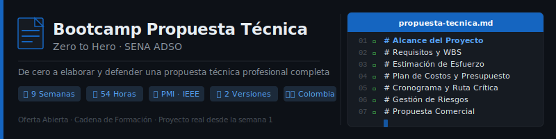

<p align="center">
  
</p>

<p align="center">
  <a href="LICENSE"></a>
  <a href="#"></a>
  <a href="#"></a>
  <a href="#"></a>
  <a href="CONTRIBUTING.md"></a>
</p>

<p align="center">
  <a href="README_EN.md"></a>
</p>

---

## 📋 Descripción

Bootcamp de **9 semanas (~1 trimestre)** enfocado en la **Realización y Estimación de Propuesta Técnica** para proyectos de desarrollo de software. Diseñado para llevar a aprendices del SENA de cero a la elaboración y defensa de una propuesta técnica profesional completa.

Disponible en **dos versiones** según el perfil del aprendiz:

- **Oferta Abierta**: Trimestre IV del Tecnólogo ADSO — bases del programa ya acumuladas
- **Cadena de Formación**: Trimestre III-IV — graduados Técnico en Programación que encadenan al Tecnólogo ADSO

### 🎯 Objetivos

Al finalizar el bootcamp, los aprendices serán capaces de:

- ✅ Levantar requisitos funcionales y no funcionales de un cliente
- ✅ Definir el alcance de un proyecto de software de forma justificada
- ✅ Aplicar al menos 3 técnicas de estimación de esfuerzo y costo
- ✅ Construir un cronograma básico de proyecto con hitos y ruta crítica
- ✅ Redactar una propuesta técnica profesional completa
- ✅ Elaborar una propuesta comercial con tabla de costos justificada
- ✅ Gestionar riesgos del proyecto con matriz de probabilidad/impacto
- ✅ Presentar y defender la propuesta ante un comité evaluador

### 💡 ¿Por qué este bootcamp?

> **La propuesta técnica se construye sección a sección desde la semana 1** — al llegar a la semana 9, el documento final está casi completo.

Muchos programas de formación en desarrollo de software enseñan a programar pero no a **comunicar y justificar** lo que se va a construir. Este bootcamp cubre exactamente esa brecha: usa un caso de estudio ficticio para aprender las herramientas, y el proyecto real de cada aprendiz como hilo conductor de todos los entregables.

---

## 🗓️ Estructura del Bootcamp

### Versión A — Oferta Abierta (Trimestre IV · ADSO)

| Fase | Semanas | Horas | Enfoque |
| :---: | :---: | :---: | --- |
| **Fundamentos** | 1-2 | 12h | Análisis avanzado de requisitos + alcance y factibilidad técnica |
| **Estimación** | 3-5 | 18h | Técnicas comparativas, estimación cuantitativa, presupuesto |
| **Planificación** | 6 | 6h | Cronograma, Gantt, CPM, gestión de recursos |
| **Propuesta** | 7-8 | 12h | Redacción técnica + propuesta comercial, riesgos y aspectos legales |
| **Cierre** | 9 | 6h | Presentación y defensa — Proyecto Final |

### Versión B — Cadena de Formación (Trimestre III-IV · Técnico en Programación)

| Fase | Semanas | Horas | Enfoque |
| :---: | :---: | :---: | --- |
| **Fundamentos** | 1-3 | 18h | Contexto del proyecto + requisitos + alcance básico |
| **Estimación** | 4-6 | 18h | Técnicas simplificadas + esfuerzo/tiempo + costos |
| **Propuesta** | 7-8 | 12h | Redacción técnica + propuesta comercial y riesgos |
| **Cierre** | 9 | 6h | Presentación y defensa — Proyecto Final |

**Total: 9 semanas** | **54 horas** de formación

---

## 📚 Contenido por Semana

Cada semana incluye:

```
bootcamp/
├── oferta-abierta/
│   └── week-XX-tema_principal/
│       ├── README.md                # Descripción y objetivos
│       ├── rubrica-evaluacion.md    # Criterios de evaluación
│       ├── 0-assets/               # Imágenes y diagramas
│       ├── 1-teoria/               # Material teórico (caso ficticio)
│       ├── 2-practicas/            # Talleres guiados (caso ficticio)
│       ├── 3-proyecto/             # Entregable aplicado al proyecto real
│       ├── 4-recursos/             # Recursos adicionales
│       │   ├── ebooks-free/
│       │   ├── videografia/
│       │   └── webgrafia/
│       └── 5-glosario/             # Términos clave
└── cadena-formacion/
    └── week-XX-tema_principal/     # (misma estructura)
```

### 🔑 Componentes Clave

- 📖 **Teoría**: Conceptos aplicados al caso de estudio ficticio compartido
- 💻 **Prácticas**: Talleres guiados sobre el mismo caso ficticio
- 🚀 **Proyecto**: Entregable semanal aplicado al proyecto real del aprendiz
- 🎓 **Recursos**: Glosarios, estándares (PMI, IEEE, NTC) y material complementario

---

## 🛠️ Herramientas del Bootcamp

| Herramienta | Uso | Costo |
| --- | --- | :---: |
| Markdown + GitHub | Documentación con control de versiones | Gratuito |
| Draw.io / diagrams.net | Diagramas UML, WBS, arquitectura, matrices | Gratuito |
| Google Sheets / LibreOffice Calc | Tablas de estimación y presupuesto | Gratuito |
| ProjectLibre | Cronogramas Gantt y gestión de recursos | Gratuito |
| ClickUp (free tier) | Gestión ágil de tareas y proyecto colaborativo | Gratuito |
| GitHub Projects | Tableros kanban vinculados al repositorio | Gratuito |
| Google Slides / LibreOffice Impress | Presentaciones ejecutivas | Gratuito |
| Miro (free tier) | Talleres colaborativos virtuales | Gratuito |
| Brave / Firefox | Navegador recomendado | Gratuito |

---

## 🚀 Inicio Rápido

### Prerrequisitos

- **Git** para control de versiones
- **VS Code** (recomendado) con extensiones incluidas
- Cuenta de **GitHub** activa
- **Brave** o **Firefox** como navegador (recomendados)
- Herramientas gratuitas listadas arriba

### 1. Clonar el Repositorio

```bash
git clone https://github.com/ergrato-dev/bc-propuesta-tecnica.git
cd bc-propuesta-tecnica
```

### 2. Instalar Extensiones de VS Code

```bash
# Abrir en VS Code
code .

# Las extensiones recomendadas aparecerán automáticamente
# O ejecutar: Ctrl+Shift+P → "Extensions: Show Recommended Extensions"
```

### 3. Elegir tu Versión

```bash
# Oferta Abierta (Trimestre IV · ADSO)
cd bootcamp/oferta-abierta/week-01-analisis_requisitos_avanzado

# Cadena de Formación (Técnico en Programación → Tecnólogo)
cd bootcamp/cadena-formacion/week-01-contexto_y_propuesta_tecnica
```

### 4. Seguir las Instrucciones

Cada semana contiene un `README.md` con instrucciones detalladas.

---

## 📊 Metodología de Aprendizaje

### Estrategias Didácticas

- 🎯 **Aprendizaje Basado en Proyectos (ABP)**: el proyecto real del aprendiz es el hilo conductor
- 🎭 **Roleplay cliente-consultor**: simulación de entrevistas desde la semana 2
- 🧩 **Construcción incremental**: la propuesta se arma sección a sección cada semana
- 👥 **Peer Review**: revisión de propuestas entre aprendices en la semana final
- 📚 **Caso de estudio compartido**: mismo contexto ficticio para toda la clase

### Distribución del Tiempo (6h/semana)

- **Teoría**: 1.5-2 horas
- **Prácticas**: 2.5-3 horas
- **Proyecto**: 1.5-2 horas

### Evaluación

Cada semana incluye tres tipos de evidencias:

1. **Conocimiento 🧠** (30%): Cuestionarios, mapas conceptuales, preguntas de reflexión
2. **Desempeño 💪** (40%): Talleres sobre el caso de estudio ficticio
3. **Producto 📦** (30%): Entregable aplicado al proyecto real del aprendiz

**Criterio de aprobación**: Mínimo 70% en cada tipo de evidencia

---

## 🤝 Contribuir

¡Las contribuciones son bienvenidas! Este es un proyecto educativo de código abierto.

### Cómo Contribuir

1. Lee la [Guía de Contribución](CONTRIBUTING.md)
2. Revisa el [Código de Conducta](CODE_OF_CONDUCT.md)
3. Fork del repositorio
4. Crea tu rama (`git checkout -b feature/nueva-funcionalidad`)
5. Commit con [Conventional Commits](https://www.conventionalcommits.org/) (`git commit -m 'feat: add new exercise'`)
6. Push a la rama (`git push origin feature/nueva-funcionalidad`)
7. Abre un Pull Request

### 📋 Áreas de Contribución

- ✨ Ejercicios y talleres adicionales
- 📚 Mejoras en documentación y teoría
- 🐛 Corrección de errores
- 🎨 Recursos visuales (diagramas SVG)
- 🌐 Traducciones
- 📋 Plantillas y rúbricas

---

## 📞 Soporte

- 💬 **Discussions**: [GitHub Discussions](https://github.com/ergrato-dev/bc-propuesta-tecnica/discussions)
- 🐛 **Issues**: [GitHub Issues](https://github.com/ergrato-dev/bc-propuesta-tecnica/issues)

---

## ⚠️ Exención de Responsabilidad

Este repositorio es un recurso **educativo** creado con fines de aprendizaje. Al utilizarlo, aceptas los siguientes términos:

- **Solo fines educativos**: El contenido, los ejemplos y los proyectos están diseñados exclusivamente para la enseñanza y el aprendizaje. No constituyen asesoramiento profesional, legal ni comercial.
- **Sin garantías**: El material se proporciona **"tal cual"**, sin garantías de ningún tipo, expresas o implícitas.
- **Precios y tarifas**: Las referencias a costos del mercado TI colombiano son orientativas. Siempre valida con fuentes actualizadas antes de usar en propuestas reales.
- **Versiones de estándares**: Los estándares y normas mencionados (PMI, IEEE, ISO, NTC) pueden actualizarse. Consulta siempre la versión oficial más reciente.
- **Limitación de responsabilidad**: Los autores y contribuidores no se responsabilizan por decisiones comerciales o contractuales tomadas con base en este material.
- **Responsabilidad del aprendiz**: Cada aprendiz es responsable de sus propias propuestas, entregables y decisiones de proyecto.

---

## 📄 Licencia

Este proyecto está bajo la Licencia MIT - ver el archivo [LICENSE](LICENSE) para más detalles.

---

## 🏆 Agradecimientos

- [PMI](https://www.pmi.org/) - Por el estándar PMBOK que fundamenta gran parte del contenido
- [IEEE / SWEBOK](https://www.computer.org/education/bodies-of-knowledge/software-engineering) - Por el cuerpo de conocimiento en ingeniería de software
- [ISO 25010](https://iso25000.com/) - Por el modelo de calidad de software
- [ICONTEC](https://www.icontec.org/) - Por las normas NTC colombianas
- [MinTIC Colombia](https://www.mintic.gov.co/) - Por las guías de gobierno digital
- Comunidad SENA ADSO - Por los casos reales que inspiraron el contenido
- Todos los contribuidores

---

## 📚 Documentación Adicional

- [🤖 Instrucciones de Copilot](.github/copilot-instructions.md)
- [🤝 Guía de Contribución](CONTRIBUTING.md)
- [📜 Código de Conducta](CODE_OF_CONDUCT.md)
- [🔒 Política de Seguridad](SECURITY.md)
- [📁 Caso de Estudio](docs/caso-estudio/)
- [📖 Documentación General](docs/)

---

<p align="center">
  <strong>🎓 Bootcamp Propuesta Técnica - Zero to Hero</strong><br>
  <em>De cero a elaborar y defender una propuesta técnica profesional</em>
</p>

<p align="center">
  <a href="bootcamp/oferta-abierta/week-01-analisis_requisitos_avanzado">Comenzar Oferta Abierta</a> •
  <a href="bootcamp/cadena-formacion/week-01-contexto_y_propuesta_tecnica">Comenzar Cadena de Formación</a> •
  <a href="docs">Ver Documentación</a> •
  <a href="https://github.com/ergrato-dev/bc-propuesta-tecnica/issues">Reportar Issue</a>
</p>

<p align="center">
  Hecho con ❤️ para la comunidad de aprendices SENA
</p>
