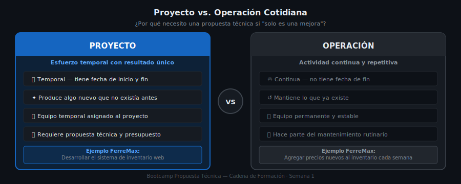
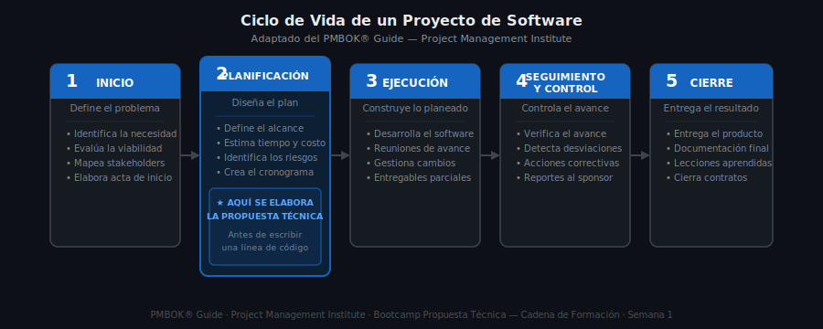

# 📖 01 — ¿Qué es un Proyecto de Software?

> Teoría · Semana 1 · Cadena de Formación
> Aplica al caso de estudio: **FerreMax S.A.S.**

---

## 🎯 Objetivos

- Definir qué es un proyecto según el estándar PMI (versión simplificada)
- Distinguir un proyecto de una operación cotidiana
- Identificar las fases del ciclo de vida básico de un proyecto
- Reconocer los tipos de metodología de proyecto más comunes

---

## 1. ¿Qué es un Proyecto?

Un **proyecto** es un esfuerzo temporal que se emprende para crear un producto, servicio o resultado **único**.

Tres palabras clave:

| Palabra | Significado |
|---------|-------------|
| **Temporal** | Tiene fecha de inicio y fecha de fin definidas |
| **Único** | Su resultado no existía antes — no es algo repetitivo |
| **Esfuerzo** | Requiere personas, tiempo, dinero y recursos organizados |

> 📌 Fuente: Adaptado del *PMBOK® Guide* (Project Management Institute).

---

## 2. Proyecto vs. Operación Cotidiana



Una de las confusiones más comunes es creer que "mejorar el sistema" o "agregar una nueva función" es siempre un proyecto. No siempre lo es.

| **Proyecto** | **Operación** |
|-------------|---------------|
| Temporal — tiene inicio y fin | Continua — se repite indefinidamente |
| Produce algo nuevo/único | Mantiene lo que ya existe |
| Equipo temporal asignado | Equipo estable y permanente |
| Ejemplo: *construir* el sistema de inventario | Ejemplo: *actualizar precios* en el sistema todos los días |
| Requiere propuesta técnica | Forma parte del mantenimiento cotidiano |

**Ejemplo aplicado a FerreMax:**

- ✅ **Proyecto:** Desarrollar un sistema web para gestionar el inventario de FerreMax.
- ❌ **No es proyecto:** Agregar un producto nuevo al inventario cada semana una vez el sistema esté funcionando.

---

## 3. Ciclo de Vida de un Proyecto



Todo proyecto atraviesa fases predecibles. Conocerlas ayuda a planificar mejor y a saber en qué momento se construye cada parte.

```
INICIO ──▶ PLANIFICACIÓN ──▶ EJECUCIÓN ──▶ SEGUIMIENTO ──▶ CIERRE
  │              │                │               │             │
Define el    Diseña el         Construye       Controla      Entrega
problema     plan              lo planeado     avances       resultado
```

### Descripción de cada fase:

**1. Inicio**
- Se define el problema o necesidad
- Se evalúa si el proyecto es viable
- Se identifican los stakeholders principales
- Se produce el "acta de inicio" del proyecto

**2. Planificación**
- Se define el alcance en detalle
- Se estima el tiempo y los costos
- Se identifican los riesgos
- Se crea el cronograma
- **⭐ Aquí se elabora la propuesta técnica**

**3. Ejecución**
- El equipo construye el software
- Se hacen reuniones de seguimiento
- Se gestionan cambios de requisitos

**4. Seguimiento y Control**
- Se verifica que el proyecto avanza según el plan
- Se detectan desviaciones (retrasos, sobrecostos)
- Se toman acciones correctivas

**5. Cierre**
- Se entrega el producto final al cliente
- Se documenta lo aprendido
- Se libera al equipo del proyecto

---

## 4. Tipos de Metodología

No existe una sola forma de gestionar proyectos. Las más comunes en el sector TI colombiano son:

| Metodología | Características | Cuándo usarla |
|-------------|----------------|---------------|
| **Predictiva** (cascada) | Planificación completa al inicio, fases secuenciales | Requisitos muy claros y estables |
| **Ágil** (Scrum/Kanban) | Entregas parciales cada 2-4 semanas, requisitos pueden cambiar | Proyectos con cambios frecuentes, startups |
| **Híbrida** | Mezcla planificación estructurada + entregas ágiles | PME y proyectos medianos en Colombia |

> 💡 En el Bootcamp usaremos una **metodología híbrida** para aprender a elaborar la propuesta técnica: tomamos lo mejor de la planificación estructurada (predictiva) y la flexibilidad de las entregas ágiles. En el mundo laboral real, la metodología debe elegirse según el contexto del cliente.

---

## 5. Aplicación al Caso FerreMax

**Situación actual de FerreMax S.A.S.:**
- Carlos Mendoza, Gerente General, necesita un sistema para gestionar el inventario de la ferretería
- Actualmente usan Excel y WhatsApp para controlar los productos
- Tienen problemas: productos agotados, pedidos perdidos, errores en facturación

**¿Es esto un proyecto?**

| Criterio | FerreMax |
|----------|---------|
| ¿Es temporal? | ✅ Sí — se construye una sola vez |
| ¿Es único? | ✅ Sí — un sistema a la medida de FerreMax |
| ¿Requiere recursos? | ✅ Sí — desarrolladores, tiempo, presupuesto |
| ¿Tiene cliente y sponsor? | ✅ Sí — Carlos Mendoza |

**Conclusión:** Desarrollar el sistema de inventario de FerreMax **es un proyecto de software**. Por eso necesita una propuesta técnica antes de comenzar a programar.

---

## ✅ Checklist de la Teoría

Antes de continuar, verifica que puedes:

- [ ] Definir "proyecto" con tus propias palabras
- [ ] Dar un ejemplo de proyecto y uno de operación en el sector TI
- [ ] Nombrar las 5 fases del ciclo de vida de un proyecto
- [ ] Explicar para qué sirve la fase de planificación

---

## 📚 Para Profundizar

- [PMI — ¿Qué es la gestión de proyectos?](https://www.pmi.org/about/learn-about-pmi/what-is-project-management) *(en inglés)*
- Busca en Brave: "gestión de proyectos de software Colombia" para ver ejemplos locales

---

*Siguiente: [02 — Roles del Proyecto →](./02-roles-del-proyecto.md)*
