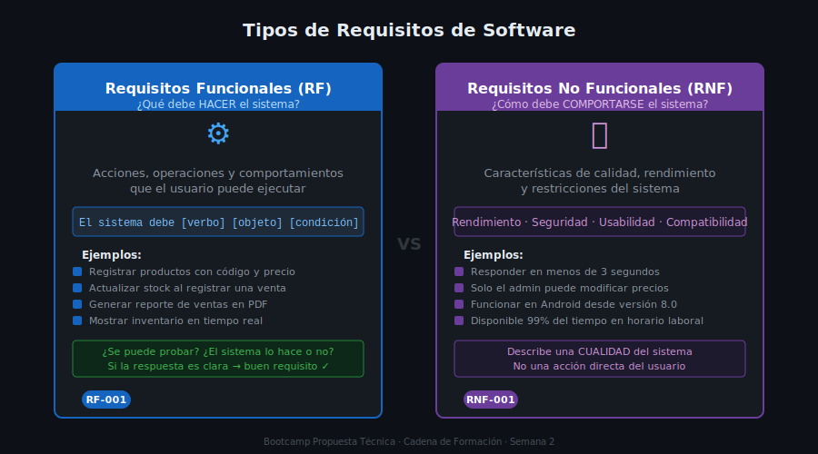

# 📖 01 — ¿Qué son los Requisitos?

> Teoría · Semana 2 · Cadena de Formación
> Aplica al caso de estudio: **FerreMax S.A.S.**

---

## 🎯 Objetivos

- Definir qué es un requisito en el contexto del desarrollo de software
- Distinguir entre requisitos funcionales y no funcionales con ejemplos concretos
- Identificar las características de un buen requisito (claro, verificable, completo)
- Reconocer los problemas más comunes al escribir requisitos

---

## 1. ¿Qué es un Requisito?

Un **requisito** es una condición o capacidad que un sistema debe tener o cumplir para satisfacer la necesidad de un cliente o usuario.

En palabras simples: es la respuesta a la pregunta **"¿Qué debe hacer o cómo debe comportarse el sistema?"**

Los requisitos son la materia prima de una propuesta técnica. Sin requisitos bien documentados, no se puede estimar, planificar ni construir nada con certeza.

> 📌 Norma IEEE 830-1998 (simplificada): Un requisito es una descripción de lo que el sistema debe hacer, de las propiedades que debe tener, o de las restricciones que debe cumplir.

---

## 2. Tipos de Requisitos

### 2.1 Requisitos Funcionales (RF)

Describen **qué debe hacer** el sistema. Son las acciones, operaciones o comportamientos que el usuario puede realizar o que el sistema ejecuta automáticamente.

**Fórmula:** `El sistema debe [verbo de acción] [objeto] [condición opcional].`

**Ejemplos aplicados a FerreMax:**

| ID | Descripción | Prioridad |
|----|-------------|-----------|
| RF-001 | El sistema debe permitir registrar productos con código, nombre, categoría y precio | Alta |
| RF-002 | El sistema debe actualizar el stock automáticamente al registrar una venta | Alta |
| RF-003 | El sistema debe mostrar el inventario disponible en tiempo real para todas las sedes | Alta |
| RF-004 | El sistema debe generar un reporte de ventas del día en formato PDF | Media |
| RF-005 | El sistema debe enviar una alerta cuando el stock de un producto caiga por debajo del mínimo definido | Media |

**Características de un buen RF:**
- Usa un verbo de acción concreto (registrar, mostrar, generar, actualizar, eliminar, buscar...)
- Se puede probar: hay una forma de verificar si el sistema lo hace o no
- No dice *cómo* implementarlo — solo dice *qué* debe ocurrir

---

### 2.2 Requisitos No Funcionales (RNF)

Describen **cómo debe comportarse** el sistema en términos de calidad, rendimiento, seguridad, usabilidad u otras características que no son acciones directas del usuario, pero que son clave para que el sistema funcione bien.

**Categorías comunes:**

| Categoría | ¿Qué describe? | Ejemplo |
|-----------|---------------|---------|
| **Rendimiento** | Velocidad de respuesta, carga máxima | El sistema debe responder en menos de 3 segundos |
| **Seguridad** | Autenticación, control de acceso, cifrado | Solo usuarios autorizados pueden modificar precios |
| **Usabilidad** | Facilidad de uso, interfaz intuitiva | Un vendedor sin experiencia técnica debe poder registrar una venta en menos de 2 minutos |
| **Disponibilidad** | Tiempo activo, tolerancia a fallos | El sistema debe estar disponible el 99% del tiempo en horario laboral |
| **Compatibilidad** | Dispositivos, navegadores, sistemas operativos | Debe funcionar en celulares Android desde la versión 8.0 |
| **Mantenibilidad** | Facilidad para actualizar o corregir | El código debe seguir buenas prácticas para facilitar futuras correcciones |

**Ejemplos aplicados a FerreMax:**

| ID | Descripción | Categoría |
|----|-------------|-----------|
| RNF-001 | El sistema debe responder a cualquier consulta en menos de 3 segundos con conexión a internet normal | Rendimiento |
| RNF-002 | Solo el administrador puede modificar los precios del catálogo | Seguridad |
| RNF-003 | El sistema debe funcionar correctamente en celulares Android desde la versión 8.0 | Compatibilidad |
| RNF-004 | La interfaz debe ser usable sin capacitación técnica previa — tareas básicas en menos de 5 pasos | Usabilidad |

---

## 3. Características de un Buen Requisito

No todos los requisitos se escriben bien desde el principio. Un buen requisito debe cumplir estas características:

| Característica | Descripción | Ejemplo de problema |
|----------------|-------------|---------------------|
| **Claro** | Una sola interpretación posible | ❌ "El sistema debe ser rápido" — ¿qué tan rápido? |
| **Verificable** | Se puede probar si se cumple o no | ❌ "El sistema debe ser fácil de usar" — no se puede medir directamente |
| **Completo** | No omite información necesaria para implementarlo | ❌ "El sistema debe generar reportes" — ¿qué tipo? ¿en qué formato? ¿para quién? |
| **Consistente** | No contradice a otro requisito | ❌ RF-003: "Solo admin puede ver ventas" + RF-007: "Todos los empleados ven ventas" |
| **Necesario** | El proyecto lo requiere de verdad, no es un deseo adicional | ❌ "El sistema debe tener un modo oscuro" (si nadie lo pidió) |

---

## 4. Problemas Comunes al Documentar Requisitos

### 4.1 Requisito Ambiguo

Un requisito ambiguo tiene más de una interpretación válida. El programador lo entiende diferente al cliente.

> ❌ **Ambiguo:** "El sistema debe mostrar el inventario de manera eficiente."
>
> ✅ **Claro:** "El sistema debe mostrar la lista completa de productos con stock disponible en menos de 2 segundos al abrir el módulo de inventario."

---

### 4.2 Requisito Incompleto

Le falta información para poder implementarlo con certeza.

> ❌ **Incompleto:** "El sistema debe generar un reporte."
>
> ✅ **Completo:** "El sistema debe generar un reporte de ventas del día en formato PDF, con columnas de: producto, cantidad vendida, precio unitario y total. El gerente debe poder descargarlo desde el panel principal."

---

### 4.3 Requisito Implícito

El cliente da por hecho algo que nunca menciona explícitamente, pero que el sistema debe cumplir.

**Ejemplo FerreMax:** Carlos Mendoza nunca dijo que el sistema debe tener usuarios y contraseñas. Pero es obvio que no puede dejar el inventario accesible sin autenticación. Ese es un requisito implícito que el consultor debe descubrir y documentar.

**Cómo encontrarlos:** preguntar "¿Qué pasa si...?" durante la entrevista:
- ¿Qué pasa si alguien que no trabaja en FerreMax intenta entrar al sistema?
- ¿Qué pasa si se va la luz y se pierde la venta que estaban registrando?

---

## 5. Priorización de Requisitos

No todos los requisitos tienen el mismo valor. La prioridad ayuda a decidir **qué se construye primero**.

| Prioridad | Significado | Cuándo asignarla |
|-----------|-------------|-----------------|
| **Alta** | El sistema no funciona sin esto — es esencial | Funcionalidades que el cliente mencionó como críticas o que resuelven el problema principal |
| **Media** | Importante pero el sistema puede funcionar sin ello temporalmente | Funcionalidades útiles que pueden esperar a una segunda fase |
| **Baja** | Deseable pero no urgente | Mejoras estéticas, reportes adicionales, integraciones opcionales |

> 💡 **Regla práctica:** Si el cliente dice "sin eso el sistema no me sirve", es prioridad Alta.

---

## ✅ Checklist de Verificación

Antes de continuar con las técnicas de levantamiento, asegúrate de que entiendes:

- [ ] La diferencia entre RF y RNF con al menos un ejemplo propio
- [ ] Qué hace que un requisito sea "bueno" vs "deficiente"
- [ ] Qué es un requisito implícito y cómo descubrirlo
- [ ] Cómo asignar prioridad (Alta / Media / Baja)

---

*Cadena de Formación · Tecnólogo ADSO · Semana 2 de 9*
