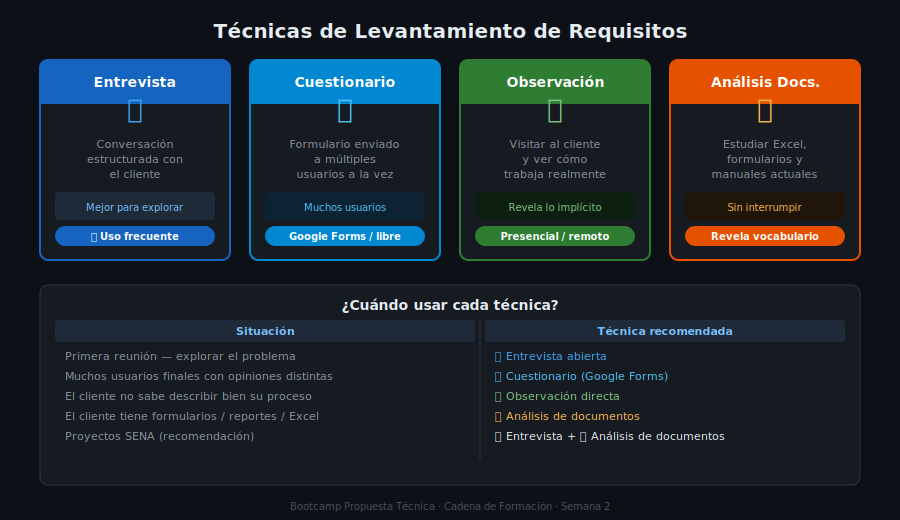

# 📖 02 — Técnicas de Levantamiento de Requisitos

> Teoría · Semana 2 · Cadena de Formación
> Aplica al caso de estudio: **FerreMax S.A.S.**

---

## 🎯 Objetivos

- Conocer las principales técnicas de levantamiento de requisitos
- Identificar cuándo usar cada técnica según el contexto del proyecto
- Aplicar la entrevista como técnica principal para proyectos pequeños y medianos
- Reconocer las ventajas y limitaciones de cada técnica

---

## 1. ¿Qué es el Levantamiento de Requisitos?

El **levantamiento de requisitos** (también llamado *elicitación de requisitos*) es el proceso de descubrir, recopilar y documentar lo que los clientes y usuarios necesitan del sistema.

No se trata de adivinar ni de asumir. Se trata de **preguntar, escuchar, observar y confirmar**.

> 🎯 El objetivo no es solo escuchar lo que el cliente dice que quiere, sino entender también lo que necesita — que a veces es diferente.

---

## 2. Principales Técnicas

### 2.1 Entrevista

La técnica más usada. Es una conversación estructurada entre el consultor y el cliente o usuario para descubrir necesidades, problemas y expectativas.

**Tipos de pregunta:**

| Tipo | Cuándo usar | Ejemplo |
|------|-------------|---------|
| **Abierta** | Al inicio, para explorar | "¿Cómo funciona actualmente el proceso de inventario?" |
| **Cerrada** | Para confirmar o precisar | "¿Necesita el sistema funcionar en celular?" |
| **De profundidad** | Cuando una respuesta genera más preguntas | "¿Con qué frecuencia ocurre ese problema?" |
| **Hipotética** | Para descubrir requisitos implícitos | "¿Qué pasaría si se va la luz mientras registran una venta?" |

**Ventajas:**
- Permite preguntar en el momento cuando algo no está claro
- El cliente se siente escuchado — mejora la relación
- Se pueden descubrir requisitos que el cliente no sabía que tenía

**Limitaciones:**
- Requiere tiempo de agenda del cliente
- Depende de la habilidad del entrevistador
- Un cliente puede olvidar mencionar cosas importantes

**Aplicado a FerreMax:** La reunión en semana 1 fue una entrevista exploratoria. La reunión de semana 2 es una entrevista de profundización para aclarar las preguntas que quedaron sin responder.

---

### 2.2 Cuestionario

Formulario con preguntas predefinidas que se envía o aplica a múltiples usuarios. Útil cuando hay muchas personas involucradas o cuando el cliente está lejos.

**Ventajas:**
- Permite recopilar opiniones de muchos usuarios a la vez
- Barato y rápido de aplicar con herramientas como Google Forms
- El usuario responde en su propio tiempo

**Limitaciones:**
- No se puede aclarar ambigüedades en el momento
- Las respuestas pueden ser superficiales
- Baja tasa de respuesta si el formulario es muy largo

**Cuándo usarlo en proyectos SENA:**
- Cuando hay varios usuarios finales con perfiles distintos (ej: vendedores + bodeguero + contadora de FerreMax)
- Para validar prioridades: "De estos 10 requisitos, ¿cuáles 3 son más importantes para ti?"

---

### 2.3 Observación directa

El consultor visita al cliente y observa cómo trabaja actualmente, sin interrumpir.

**Ventajas:**
- Descubre problemas que el cliente no sabe cómo describir
- Muestra el proceso real (no el proceso "ideal" que el cliente describe)
- Identifica ineficiencias que el sistema podría resolver

**Limitaciones:**
- Requiere desplazamiento físico o acceso remoto
- El cliente puede sentirse vigilado y actuar diferente a lo normal

**Ejemplo FerreMax:** El consultor observa cómo Pedro Arias registra una venta en mostrador. Ve que tiene que llamar a Laura por WhatsApp para confirmar si el producto está en bodega antes de decírselo al cliente. Eso genera un requisito que nadie había mencionado explícitamente.

---

### 2.4 Taller de requisitos (workshop)

Sesión de trabajo colaborativo con todos los stakeholders al mismo tiempo para definir o validar requisitos en grupo.

**Ventajas:**
- Resuelve contradicciones entre stakeholders en el momento
- Genera consenso — todos salen con los mismos acuerdos
- Es eficiente: una reunión reemplaza varias individuales

**Limitaciones:**
- Difícil de coordinar — hay que reunir a todos a la vez
- Puede ser dominado por las voces más fuertes (el jefe siempre tiene razón)
- Requiere un facilitador con experiencia

**Cuándo usarlo:** En proyectos grandes con muchos stakeholders. Para proyectos SENA, puede hacerse como una reunión corta de validación al final del levantamiento.

---

### 2.5 Análisis de documentos

El consultor estudia los documentos existentes del negocio del cliente (formularios, manuales, reportes, hojas de cálculo) para extraer requisitos.

**Ventajas:**
- No interrumpe al cliente
- Los documentos existentes revelan qué datos ya se manejan
- Muestra el vocabulario del negocio (cómo llaman a las cosas)

**Limitaciones:**
- Los documentos pueden estar desactualizados
- No captura problemas que no están documentados

**Ejemplo FerreMax:** El consultor pide el Excel del inventario actual. Al verlo, descubre que tiene columnas como "precio_costo", "precio_venta_Kennedy", "precio_venta_Fontibon" — eso revela que los precios varían por sede, algo que Carlos nunca mencionó en la entrevista.

---

## 3. ¿Cuándo Usar Cada Técnica?

| Situación | Técnica recomendada |
|-----------|-------------------|
| Primera reunión — explorar el problema | Entrevista abierta |
| Profundizar en requisitos específicos | Entrevista de profundización |
| Muchos usuarios finales con opiniones distintas | Cuestionario |
| El cliente no sabe describir bien su proceso | Observación directa |
| Resolver contradicciones entre stakeholders | Taller de requisitos |
| El cliente tiene formularios o reportes existentes | Análisis de documentos |
| Validar que los requisitos documentados son correctos | Revisión con el cliente (lectura del documento) |

> 💡 **Para proyectos SENA:** La combinación más práctica es **entrevista + análisis de documentos**. Si tienes acceso al cliente, agrega **observación directa**. Si hay muchos usuarios, usa un **cuestionario corto** para complementar.

---

## 4. Herramientas Gratuitas para Levantamiento

| Herramienta | Uso | Enlace |
|-------------|-----|--------|
| **Google Forms** | Cuestionarios en línea | forms.google.com |
| **Google Meet** | Entrevistas virtuales | meet.google.com |
| **Miro (free tier)** | Talleres colaborativos, mapas de requisitos | miro.com |
| **GitHub Issues** | Registrar y dar seguimiento a requisitos | github.com |
| **Google Docs** | Redactar actas y documentos de requisitos | docs.google.com |
| **LibreOffice Writer** | Alternativa offline a Google Docs | libreoffice.org |

---

## ✅ Checklist de Verificación

- [ ] Puedo nombrar y describir al menos 3 técnicas de levantamiento
- [ ] Sé cuándo usar una entrevista vs un cuestionario
- [ ] Entiendo por qué la observación directa revela más que la entrevista sola
- [ ] Tengo claro qué herramienta usaré para levantar requisitos de mi proyecto

---

*Cadena de Formación · Tecnólogo ADSO · Semana 2 de 9*
