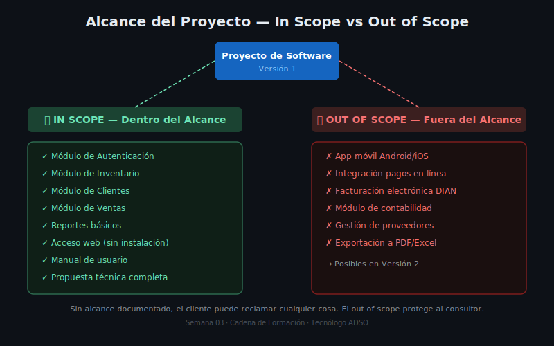

# Qué es el Alcance de un Proyecto

## 🎯 Objetivos

- Comprender qué es el alcance en el contexto de un proyecto de software
- Distinguir entre in scope y out of scope
- Entender qué es el scope creep y cómo prevenirlo
- Aplicar los conceptos de restricciones y supuestos

---

## 1. Introducción — El Contrato Invisible

Cuando un cliente te pide construir un sistema de software, en su cabeza hay una imagen de todo lo que ese software debería hacer. Esa imagen suele ser mucho más grande, más compleja y más costosa de lo que el proyecto puede entregar en el tiempo y con el presupuesto disponibles.

El **alcance del proyecto** es el acuerdo explícito de qué se construirá y qué no se construirá en esta versión. Es, en palabras simples, el límite que define el trabajo.

**Sin un alcance claro:**
- El cliente puede pedir más y más funcionalidades sin que haya un límite
- El equipo no sabe exactamente qué construir
- El proyecto nunca termina — siempre hay algo más que agregar
- El costo real supera el presupuesto
- Los plazos se incumplen

**Con un alcance claro:**
- Todos saben qué entra y qué no entra
- Se puede estimar el esfuerzo y el costo con más precisión
- El cliente firma que está de acuerdo antes de que empiece el trabajo
- Si el cliente pide algo que no está en el alcance, hay una base para negociar

---

## 2. In Scope y Out of Scope

### In Scope (dentro del alcance)

Son todas las funcionalidades, módulos y entregables que el proyecto SÍ incluirá. Deben estar descritos con suficiente detalle para que quede claro qué se espera construir.

**Ejemplos:**

| # | In Scope |
|---|----------|
| 1 | Módulo de registro y gestión de clientes (crear, editar, consultar, inactivar) |
| 2 | Módulo de inventario de productos (crear, editar, consultar stock, alertas de bajo stock) |
| 3 | Módulo de ventas: registro de facturas y consulta de historial |
| 4 | Portal de acceso con autenticación por usuario y contraseña |
| 5 | Reporte de ventas por período exportable a PDF |

### Out of Scope (fuera del alcance)

Son todas las cosas que el proyecto explícitamente NO incluirá en esta versión. El out of scope es tan importante como el in scope, porque protege al consultor y al equipo de trabajo.

**Ejemplos:**

| # | Out of Scope | Motivo |
|---|-------------|--------|
| 1 | Integración con plataformas de pago en línea (PSE, Wompi) | Fuera del presupuesto de esta versión — posible fase 2 |
| 2 | Aplicación móvil para Android/iOS | El cliente maneja sus procesos desde PC — posible fase 2 |
| 3 | Módulo de contabilidad y generación de estados financieros | Requiere integración con software contable especializado |
| 4 | Sistema de delivery o domicilios | No está entre las necesidades identificadas con el cliente |

> 📌 **Regla de oro**: Si no está en el in scope, está fuera. Si más adelante el cliente pide algo que no aparece explícitamente, el equipo puede señalar que "eso está fuera del alcance acordado". Sin este documento, no hay punto de referencia.

---

## 3. Por Qué el Out of Scope es tan Importante

Imagina este escenario: en la reunión inicial, el cliente mencionó de pasada "y también me gustaría que se pudiera ver desde el celular". Tú pensaste que era un comentario y no lo documentaste. Tres meses después, cuando el sistema ya está casi terminado, el cliente pregunta: "¿y cuándo me dan la aplicación para el celular?"

Este es el inicio de un conflicto típico en proyectos de software. Para evitarlo, el alcance documentado y firmado por el cliente establece con claridad qué se acordó desde el principio.

**Frase clave para el out of scope:**
> *"Las siguientes funcionalidades no hacen parte del alcance de esta versión del sistema. Podrán considerarse para una fase posterior del proyecto, sujeto a nueva negociación y presupuesto."*

---

## 4. Scope Creep — El Enemigo Silencioso

El **scope creep** (o "expansión del alcance") ocurre cuando el proyecto va creciendo poco a poco más allá de lo acordado, casi siempre sin que nadie lo note hasta que es demasiado tarde.



### ¿Cómo ocurre?

- El cliente pide un "pequeño cambio" que en realidad implica semanas de trabajo
- El equipo agrega una funcionalidad sin consultarlo porque "le parecía buena idea"
- Los requisitos se van agregando en reuniones informales sin actualizar el documento
- Nadie quiere decirle "no" al cliente y se acepta todo

### Consecuencias del scope creep

- El proyecto tarda más de lo planeado
- El costo real supera el presupuesto
- El equipo trabaja bajo presión constante
- La calidad se sacrifica para cumplir fechas

### Cómo prevenirlo

1. **Documentar el alcance desde el inicio** y hacerlo firmar por el cliente
2. **Usar el out of scope** para dejar claro qué no entra
3. **Tener un proceso formal de cambios**: cualquier nueva funcionalidad debe ser evaluada, presupuestada y aprobada antes de realizarse
4. **No aceptar "pequeños cambios" de forma verbal** — todo cambio debe documentarse

---

## 5. Restricciones y Supuestos

Junto al alcance, siempre deben documentarse las **restricciones** y los **supuestos** del proyecto.

### Restricciones

Son condiciones fijas que limitan el proyecto. No son negociables — son datos duros que el equipo debe respetar.

**Ejemplos de restricciones:**

| Tipo | Ejemplo |
|------|---------|
| Tiempo | El sistema debe estar en producción antes del 30 de noviembre |
| Presupuesto | El cliente tiene un presupuesto máximo de $12.000.000 COP |
| Tecnología | Debe desarrollarse con tecnologías open source (sin licencias) |
| Recursos | Solo hay un desarrollador disponible (el aprendiz) |
| Regulación | El sistema debe cumplir con la Ley 1581 de Protección de Datos |

### Supuestos

Son condiciones que el equipo **asume como verdaderas** para que el plan funcione, pero que podrían cambiar. Si un supuesto cambia, el plan debe revisarse.

**Ejemplos de supuestos:**

| Supuesto | Qué pasa si cambia |
|----------|-------------------|
| El cliente tendrá disponibilidad para revisar y aprobar avances cada dos semanas | Si no tiene disponibilidad, el proyecto se puede atrasar |
| El cliente dispondrá de un servidor o servicio de hosting para el despliegue | Si no lo tiene, habrá un costo adicional de infraestructura |
| Los datos actuales del inventario están en Excel y pueden exportarse | Si están en papel o en formatos incompatibles, la migración toma más tiempo |
| El cliente proveerá acceso al sistema actual (si existe) | Si no da acceso, no se puede analizar cómo funciona hoy |

---

## 6. Relación entre Requisitos y Alcance

En la Semana 2 levantaste los requisitos — la lista de todo lo que el sistema debería hacer. El alcance responde una pregunta diferente: **¿de todos esos requisitos, cuáles vamos a construir en esta versión?**

```
Requisitos S02          Alcance S03
───────────────         ──────────────────────────────
RF-001 ─────────────►  ✅ In scope (versión 1)
RF-002 ─────────────►  ✅ In scope (versión 1)
RF-003 ─────────────►  ⏳ Out of scope (versión 2)
RF-004 ─────────────►  ✅ In scope (versión 1)
RF-005 ─────────────►  ⏳ Out of scope (versión 2)
```

Un requisito que no entra en el alcance de esta versión no desaparece — queda en el out of scope para una futura versión. Un ítem de in scope sin requisito previo es una señal de que falta documentación en S02.

---

## 7. Aplicación al Caso de Estudio (FerreMax)

En la Semana 2, Carlos Mendoza de FerreMax nos dio una lista extensa de cosas que quería. Algunas estaban muy claras, otras eran vagas, y algunas eran claramente costosas o complejas para la primera versión.

Para FerreMax, el alcance de la versión 1 del sistema se definirá en el archivo `04-caso-ferremax-alcance.md`. El proceso que seguiremos es:

1. Tomar los requisitos documentados en S02
2. Clasificarlos: ¿cuáles entran en versión 1? ¿cuáles quedan para después?
3. Redactar la declaración de alcance
4. Documentar el out of scope con justificación
5. Listar los entregables del proyecto
6. Evaluar la factibilidad

---

## ✅ Checklist de Comprensión

Antes de pasar al siguiente archivo, verifica que puedes responder:

- [ ] ¿Cuál es la diferencia entre in scope y out of scope?
- [ ] ¿Por qué es importante documentar el out of scope?
- [ ] ¿Qué es el scope creep y cómo se previene?
- [ ] ¿Cuál es la diferencia entre una restricción y un supuesto?
- [ ] ¿Cómo se relacionan los requisitos de S02 con el alcance de S03?

---

## 📚 Recursos Adicionales

- 📖 Ver `4-recursos/ebooks-free/` para guías de gestión de alcance
- 🌐 Ver `4-recursos/webgrafia/` para referencias a PMI y estándares

---

*Siguiente: [02 — Entregables y WBS Básico →](./02-entregables-y-wbs-basico.md)*
