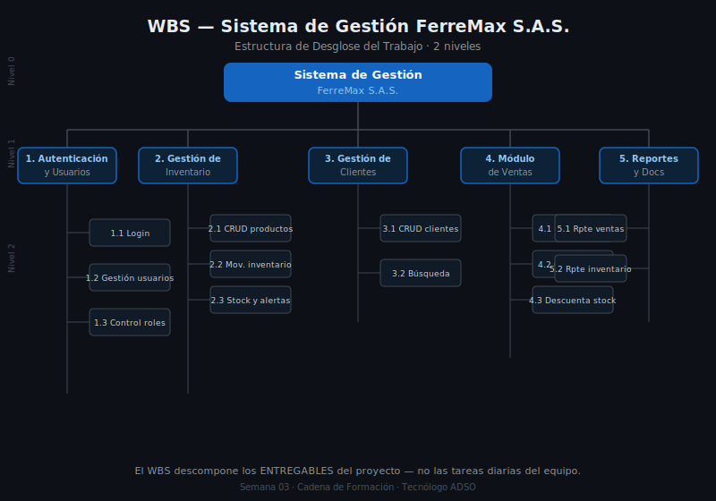

# Entregables y WBS Básico

## 🎯 Objetivos

- Entender qué es un entregable de proyecto y cómo identificarlos
- Comprender qué es el WBS (Work Breakdown Structure) / EDT
- Construir un WBS básico de dos o tres niveles para un proyecto de software
- Diferenciar entregables de software vs. entregables de documentación

---

## 1. ¿Qué es un Entregable?

Un **entregable** es cualquier resultado concreto y verificable que el proyecto produce para el cliente o para el equipo interno. La palabra clave es *verificable*: el cliente (o el instructor) puede revisar el entregable y confirmar que cumple con lo esperado.

Los entregables tienen dos características fundamentales:
1. **Son concretos** — no son actividades ni tareas, son resultados
2. **Son verificables** — hay una forma de saber si están completos o no

### Entregables de software vs. entregables de documentación

En un proyecto de software, los entregables se dividen en dos grandes grupos:

| Tipo | Ejemplos |
|------|---------|
| **Software** | Módulo de inventario, módulo de ventas, base de datos, portal web, API |
| **Documentación** | Documento de requisitos, propuesta técnica, manual de usuario, acta de reunión, diagrama de base de datos |

> 📌 La documentación también es un entregable. No es un "extra opcional" — es parte del proyecto.

### Ejemplos de entregables en un proyecto de software para PYME colombiana

| # | Entregable | Tipo | Verificable cuando... |
|---|-----------|------|----------------------|
| 1 | Módulo de gestión de clientes | Software | El usuario puede registrar, editar y consultar clientes sin errores |
| 2 | Módulo de inventario | Software | El sistema muestra stock en tiempo real y genera alertas de bajo stock |
| 3 | Módulo de ventas / facturación | Software | El sistema genera facturas con número consecutivo y calcula totales |
| 4 | Sistema de autenticación | Software | Solo usuarios registrados pueden acceder con usuario y contraseña |
| 5 | Base de datos diseñada e implementada | Software | La BD contiene todas las tablas con sus relaciones y restricciones |
| 6 | Documento de requisitos | Documentación | El documento tiene todos los RF y RNF firmados por el cliente |
| 7 | Manual de usuario | Documentación | El manual explica cómo usar cada módulo con capturas de pantalla |
| 8 | Código fuente en repositorio | Software | El repositorio tiene commits, README y código organizado |

---

## 2. Qué es el WBS (Work Breakdown Structure)

El **WBS** (Work Breakdown Structure) — o **EDT** (Estructura de Desglose del Trabajo) en español — es una descomposición jerárquica del trabajo total que el proyecto debe realizar para producir todos sus entregables.

Dicho de forma más simple: el WBS descompone el proyecto en partes cada vez más pequeñas hasta llegar a unidades de trabajo que se pueden asignar, estimar y controlar.



### ¿Para qué sirve el WBS?

- Para **visualizar** todo el trabajo del proyecto en un solo diagrama
- Para **dividir** el trabajo en paquetes manejables
- Para **asignar** responsables a cada parte del trabajo
- Para **estimar** el esfuerzo de cada componente
- Para **controlar** el avance del proyecto (¿este paquete está completo?)

### Estructura del WBS: niveles

El WBS se organiza por niveles:

```
Nivel 0 — Proyecto completo
└── Nivel 1 — Grandes grupos de trabajo (fases o módulos)
    └── Nivel 2 — Subcomponentes de cada grupo
        └── Nivel 3 — Paquetes de trabajo (tareas específicas)
```

Para proyectos de aprendizaje (proyecto de grado SENA), un WBS de **2 o 3 niveles** es suficiente.

---

## 3. Cómo Construir un WBS Básico para Software

### Paso 1: Define el proyecto completo (Nivel 0)

El Nivel 0 es simplemente el nombre del proyecto.

> **Ejemplo:** `Sistema de Gestión para FerreMax S.A.S.`

### Paso 2: Define los grandes grupos (Nivel 1)

Los grupos de nivel 1 en un proyecto de software suelen seguir uno de estos dos enfoques:

**Enfoque por módulos** (recomendado para proyectos small-medium):

```
Sistema de Gestión FerreMax
├── 1. Gestión de Clientes
├── 2. Gestión de Inventario
├── 3. Gestión de Ventas
├── 4. Administración del Sistema
└── 5. Documentación del Proyecto
```

**Enfoque por fases** (recomendado cuando hay fases distintas):

```
Sistema de Gestión FerreMax
├── 1. Análisis y Diseño
├── 2. Desarrollo
├── 3. Pruebas
├── 4. Despliegue
└── 5. Documentación
```

> Para proyectos de aprendizaje SENA, el **enfoque por módulos** es más intuitivo y visual.

### Paso 3: Desglosa cada grupo (Nivel 2)

Cada grupo de nivel 1 se descompone en sus componentes específicos:

```
1. Gestión de Clientes
   1.1. CRUD de clientes (crear, leer, actualizar, inactivar)
   1.2. Búsqueda y filtros de clientes
   1.3. Vista de historial de compras por cliente

2. Gestión de Inventario
   2.1. CRUD de productos
   2.2. Control de stock (entradas y salidas)
   2.3. Alertas de bajo stock
   2.4. Consulta de inventario por categoría
```

### Paso 4: (Opcional) Nivel 3 — Paquetes de trabajo

Para las partes más complejas, puedes desglosar hasta un tercer nivel:

```
2.1. CRUD de productos
     2.1.1. Formulario de registro de producto
     2.1.2. Vista de lista de productos con paginación
     2.1.3. Formulario de edición de producto
     2.1.4. Función de inactivar producto
```

---

## 4. WBS vs. Lista de Tareas

Hay una confusión muy común: **el WBS no es una lista de tareas** del equipo. Es una descomposición de los *entregables* del proyecto.

| WBS (entregables) | Lista de tareas (actividades) |
|-------------------|------------------------------|
| Módulo de inventario | Diseñar formulario de producto |
| CRUD de productos | Implementar función registrar() |
| Control de stock | Escribir pruebas unitarias |
| Alertas de bajo stock | Configurar correo de alerta |

La lista de tareas se deriva del WBS, pero son cosas distintas. El WBS describe *qué* se entregará; la lista de tareas describe *cómo* se construirá.

---

## 5. Reglas Básicas para un Buen WBS

### La regla de la "caja única"

Cada elemento del WBS debe aparecer **una sola vez**. Si "base de datos" aparece en el módulo de clientes y también en el módulo de ventas, hay un problema de organización.

### La regla del "100%"

El WBS debe cubrir el 100% del trabajo del proyecto. Nada que deba hacerse puede quedar fuera del WBS.

### La regla del "entregable verificable"

Cada hoja del WBS (el nivel más bajo) debe producir un entregable que se pueda verificar. "Reunión de seguimiento" no es un entregable verificable. "Acta de seguimiento firmada" sí lo es.

---

## 6. Plantilla de WBS para un Proyecto de Software (2 niveles)

Puedes representar el WBS como tabla o como diagrama. Aquí va la versión en tabla para que la uses en tu proyecto:

| Código | Nivel 1 — Componente | Código | Nivel 2 — Subcomponente | Tipo |
|--------|---------------------|--------|------------------------|------|
| 1 | [Módulo 1] | 1.1 | [Subcomponente A] | Software |
| | | 1.2 | [Subcomponente B] | Software |
| 2 | [Módulo 2] | 2.1 | [Subcomponente A] | Software |
| | | 2.2 | [Subcomponente B] | Software |
| 3 | [Módulo 3] | 3.1 | [Subcomponente A] | Software |
| 4 | Documentación | 4.1 | Documento de requisitos | Documentación |
| | | 4.2 | Propuesta técnica | Documentación |
| | | 4.3 | Manual de usuario | Documentación |
| | | 4.4 | Código fuente en repositorio | Software |

---

## 7. Conexión con la Propuesta Técnica

En la propuesta técnica que estás construyendo sobre tu proyecto real, la sección de alcance incluirá:

1. **Lista de entregables** (todo lo que el proyecto producirá)
2. **WBS básico** (descomposición de los entregables en niveles)
3. **In scope y out of scope** (lo que entra y lo que no entra)

Esta semana en el entregable `entregable-s03-alcance.md` trabajarás sobre estas tres partes.

---

## ✅ Checklist de Comprensión

- [ ] ¿Puedes dar un ejemplo de un entregable de software y uno de documentación?
- [ ] ¿Cuál es la diferencia entre el WBS y una lista de tareas?
- [ ] ¿Cuántos niveles tiene un WBS básico para un proyecto de aprendizaje?
- [ ] ¿Qué significa la "regla del 100%" en el WBS?
- [ ] ¿Por qué la documentación también es un entregable del proyecto?

---

*Anterior: [← 01 — Qué es el Alcance](./01-que-es-el-alcance.md)*
*Siguiente: [03 — Análisis de Factibilidad →](./03-factibilidad-tecnica.md)*
