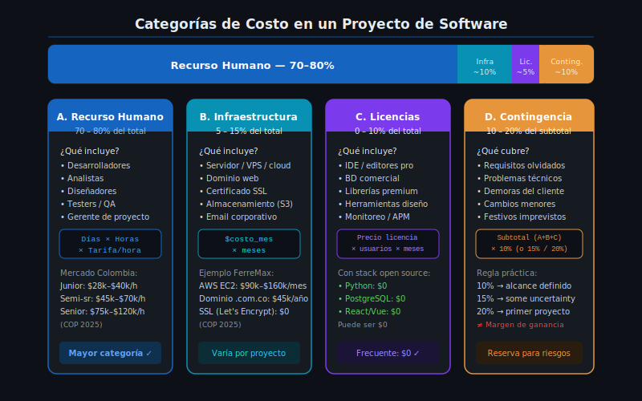

# Categorías de Costo en un Proyecto de Software

## 🎯 Objetivos

- Identificar las cuatro categorías principales de costo en proyectos de software
- Distinguir entre costos directos e indirectos
- Entender por qué el recurso humano es la categoría dominante

---

## 1. La pregunta que todo cliente hace

Antes de contratar cualquier proyecto de software, el cliente siempre pregunta lo mismo:

> *"¿Cuánto me va a costar?"*

Es una pregunta razonable. El problema es que muchos desarrolladores responden con un número al aire — sin haber analizado qué tipos de gastos realmente implica el proyecto. El resultado: proyectos que se quedan cortos de dinero, o propuestas que se pierden porque el precio estaba inflado sin justificación.

Construir un presupuesto correcto requiere primero entender **qué tipos de costos existen** en un proyecto de software.

---

## 2. Las cuatro categorías de costo



### 2.1 Recurso Humano (RH) — La categoría más grande

El software lo hace gente. Los salarios o tarifas de las personas que trabajan en el proyecto representan típicamente entre el **70% y el 85% del costo total** de cualquier proyecto de software.

Roles que pueden aparecer en un presupuesto:

| Rol | ¿Cuándo se incluye? |
|-----|---------------------|
| Desarrollador full-stack | En casi todos los proyectos de PYMES |
| Líder técnico / Arquitecto | Proyectos medianos/grandes |
| Analista de requisitos | Cuando el análisis es extenso |
| Diseñador UI/UX | Si hay diseño de interfaz dedicado |
| Tester / QA | Si las pruebas son formales |
| Gerente de proyecto | En proyectos complejos o con muchos stakeholders |

**Costo de RH = Tarifa por hora × Horas de trabajo**

Para proyectos por días:  
**Costo de RH = Tarifa diaria × Días de trabajo**

> 📌 **Dato clave para Colombia**: La tarifa de un desarrollador independiente varía entre $30,000 y $120,000 por hora según experiencia y tecnología. Lo veremos en detalle en la Teoría 02.

---

### 2.2 Infraestructura y Servicios Cloud

Todo sistema de software necesita un lugar donde vivir. Los costos de infraestructura incluyen:

| Ítem | Costo típico (COP/mes) | Ejemplo en Colombia |
|------|----------------------|---------------------|
| Servidor VPS o instancia cloud | $50,000–$300,000 | AWS EC2, DigitalOcean, Linode |
| Dominio web (.com.co) | $15,000–$40,000/año | Hosting.co, GoDaddy |
| Certificado SSL (HTTPS) | $0 (Let's Encrypt gratis) o $80,000/año | Let's Encrypt, Comodo |
| Almacenamiento de archivos (S3 o similar) | $5,000–$50,000 | AWS S3, Backblaze |
| Servicio de correo corporativo | $15,000–$30,000/usuario/mes | Google Workspace, Zoho |
| CDN (para aplicaciones grandes) | Variable | Cloudflare (hay plan gratuito) |

**Nota clave**: Para proyectos pequeños con stack open source, la infraestructura puede costar menos de $200,000 COP por mes. No es la categoría más grande, pero **no puede ignorarse**.

---

### 2.3 Licencias y Software

Incluye los costos de herramientas de pago que el proyecto requiere:

| Herramienta | Costo | Alternativa gratuita |
|-------------|-------|---------------------|
| Base de datos comercial (Oracle, SQL Server) | Alto | PostgreSQL, MySQL (gratuitos) |
| Servidor de aplicaciones comercial | Alto | Nginx, Apache (gratuitos) |
| Herramientas de monitoreo | Variable | Grafana + Prometheus (gratuitos) |
| Licencias de diseño (Figma Pro) | $70,000/mes | Figma Free tier |
| GitHub Teams | $40,000/usuario/mes | GitHub Free |

**Buena noticia para proyectos SENA/PYMES**: Con el stack típico de proyectos de formación (Python/Django, Node.js, PostgreSQL, React/Vue), el costo de licencias puede ser **$0** usando herramientas open source.

---

### 2.4 Contingencia

La contingencia es una **reserva de presupuesto** para absorber lo que no pudiste anticipar:

- Requerimientos que el cliente olvidó mencionar
- Problemas técnicos inesperados (una migración de datos más compleja de lo esperado)
- Cambios en el alcance que el cliente solicita en medio del proyecto
- Festivos o retrasos de proveedores

**¿Cuánto se reserva?**

| Nivel de incertidumbre del proyecto | Contingencia recomendada |
|-------------------------------------|--------------------------|
| Proyecto bien definido, equipo conocido, tecnología familiar | 5–10% |
| Algunos requisitos indefinidos o tecnología nueva para el equipo | 10–15% |
| Muchos requisitos abiertos o primer proyecto del tipo | 15–20% |

> ⚠️ **La contingencia NO es el margen de ganancia.** La contingencia cubre riesgos del proyecto; el margen de ganancia es la utilidad de la empresa o consultora. Son dos cosas diferentes.

---

## 3. Costos Directos vs. Costos Indirectos

Esta diferencia importa para entender qué entra en el presupuesto del proyecto:

| Tipo | Definición | Ejemplos para un proyecto de software |
|------|-----------|---------------------------------------|
| **Costo directo** | Se puede asignar específicamente a este proyecto | Salario del dev que trabaja EN este proyecto, el servidor dedicado para este sistema |
| **Costo indirecto** | Compartido entre varios proyectos o actividades | Arriendo de la oficina, internet, contabilidad, licencias corporativas |

En una propuesta técnica para un cliente, normalmente solo se incluyen los **costos directos**. Los indirectos quedan cubiertos dentro del **margen de ganancia** de la empresa.

---

## 4. La estructura básica de un presupuesto de software

Un presupuesto bien estructurado tiene esta forma:

```
PRESUPUESTO DEL PROYECTO
├── A. Recurso Humano          ← 70–85% del total
│   ├── Dev A: XX días × $YY  
│   └── Dev B: XX días × $YY  
│
├── B. Infraestructura          ← 5–15% del total
│   ├── Servidor: $ZZ/mes × meses
│   └── Dominio + SSL: $WW
│
├── C. Licencias y Software     ← 0–10% del total
│   └── (si aplica)
│
├── D. Contingencia (10%)       ← Sobre subtotal A+B+C
│
├── SUBTOTAL (sin margen)
├── Margen de ganancia (20%)    ← Si es una propuesta comercial
└── TOTAL FINAL
```

---

## 5. Un error frecuente: el precio "intuitivo"

Antes de tener esta estructura, algunos desarrolladores calculan así:

> *"Creo que este proyecto cuesta como $20 millones... ¿o serán 15? Pongamos 18."*

Este enfoque tiene tres problemas:

1. **No puedes justificarlo**: Si el cliente pregunta en qué se basa el precio, no hay respuesta.
2. **No puedes controlarlo**: Si el proyecto se extiende, no sabes si ya gastaste más de lo que cotizaste.
3. **No aprendes**: Sin un presupuesto estructurado, no puedes comparar lo que estimaste con lo que realmente costó, y el próximo proyecto será igual de incierto.

Un presupuesto estructurado, **aunque sea imperfecto**, siempre es mejor que uno intuitivo.

---

## ✅ Checklist de verificación

Después de esta clase, deberías poder:

- [ ] Nombrar las 4 categorías de costo de un proyecto de software
- [ ] Explicar por qué el recurso humano es la categoría más grande
- [ ] Dar ejemplos de costos de infraestructura reales en Colombia
- [ ] Distinguir contingencia de margen de ganancia
- [ ] Entender la diferencia entre costo directo e indirecto
