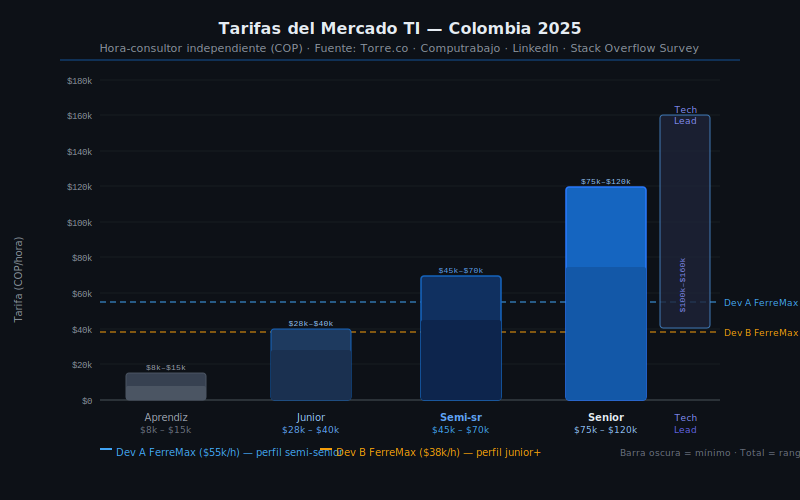

# Tarifas del Mercado TI en Colombia (2025)

## 🎯 Objetivos

- Conocer los rangos de tarifas para diferentes perfiles de desarrollo en Colombia
- Saber cómo consultar tarifas actualizadas
- Aplicar tarifas justificadas al presupuesto del proyecto

---

## 1. ¿Por qué importa conocer las tarifas del mercado?

Si cotizas muy barato:
- No cubres tus costos reales
- El cliente percibe que el trabajo tiene poca calidad
- No es sostenible para tu carrera profesional

Si cotizas muy caro sin justificación:
- Pierdes la propuesta frente a competidores
- Dañas tu reputación si no puedes defender el precio

El objetivo es **cotizar con base en el mercado real** y poder defender cada número.

---

## 2. Modalidades de contratación en TI Colombia

Antes de hablar de números, es importante entender en qué modalidad se contrata el trabajo:

| Modalidad | Descripción | Cuándo se usa |
|-----------|-------------|---------------|
| **Tarifa por hora (T&M)** | Se cobra por cada hora trabajada | Proyectos con alcance incierto o evolutivo |
| **Precio fijo (llave en mano)** | Se cobra un monto total por el proyecto completo | Cuando el alcance está bien definido |
| **Por sprint o entrega** | Se cobra al completar cada iteración | Proyectos ágiles con cliente activo |
| **Mensualidad (outsourcing)** | El developer trabaja como si fuera empleado del cliente | Proyectos de larga duración o mantenimiento |

Para efectos de este bootcamp, **usaremos tarifa por día** (derivada de la tarifa por hora × 8 horas), que es la más fácil de conectar con los días-persona estimados.

---

## 3. Rangos de tarifas por perfil (Colombia, 2025)

### 3.1 Desarrolladores independientes (freelance/consultoría)

> Estas son tarifas para trabajo por proyecto o freelance, sin prestaciones sociales incluidas. El desarrollador asume sus propios costos de seguridad social.

| Perfil | Experiencia | Tarifa hora (COP) | Tarifa día (COP) | Tarifa mes aprox. (COP) |
|--------|------------|-------------------|-----------------|------------------------|
| **Junior** | 0–2 años | $28,000–$40,000 | $224,000–$320,000 | $4,480,000–$6,400,000 |
| **Semi-senior** | 2–4 años | $45,000–$70,000 | $360,000–$560,000 | $7,200,000–$11,200,000 |
| **Senior** | 4+ años | $75,000–$120,000 | $600,000–$960,000 | $12,000,000–$19,200,000 |
| **Tech Lead / Arquitecto** | 6+ años | $100,000–$160,000 | $800,000–$1,280,000 | $16,000,000–$25,600,000 |

> Base de cálculo: Tarifa día = Tarifa hora × 8 horas · Tarifa mes = Tarifa día × 20 días hábiles

### 3.2 Desarrolladores empleados (contrato laboral)

> Si la empresa tiene al desarrollador en nómina, el costo mensual incluye prestaciones sociales (~52% adicional sobre el salario base: prima, cesantías, salud, pensión, ARL, vacaciones).

| Perfil | Salario base mensual (COP) | Con prestaciones (~52%) |
|--------|---------------------------|------------------------|
| Junior | $2,200,000–$3,500,000 | $3,344,000–$5,320,000 |
| Semi-senior | $4,000,000–$6,500,000 | $6,080,000–$9,880,000 |
| Senior | $7,000,000–$12,000,000 | $10,640,000–$18,240,000 |

> ⚠️ **Para el presupuesto de tu propuesta técnica**, usa la **tarifa de freelance** (con prestaciones incluidas en la tarifa) si eres consultor independiente; o el **costo con prestaciones** si es empleado.

---

## 4. Factores que afectan la tarifa

No todos los desarrolladores con igual experiencia cobran lo mismo. La tarifa varía por:

| Factor | Efecto en la tarifa |
|--------|---------------------|
| **Tecnología especializada** | React Native, blockchain, IA/ML → tarifas 20–40% más altas |
| **Ciudad** | Bogotá > Medellín > Cali en tarifa promedio |
| **Trabajo remoto vs. presencial** | Remoto suele dar acceso a tarifas regionales más altas |
| **Tamaño del proyecto** | Proyectos grandes y bien pagados = tarifas más altas |
| **Urgencia** | Si el cliente necesita arrancar en 1 semana, la tarifa puede subir |
| **Perfil aprendiz SENA** | Para proyectos de formación sin ánimo de lucro, se puede usar $0 (práctica) o tarifa junior reducida |

---

## 5. Fuentes para consultar tarifas actualizadas

Las tarifas cambian. Para actualizar tus presupuestos, consulta:

| Fuente | Qué información da |
|--------|--------------------|
| **Computrabajo** (computrabajo.com.co) | Salarios publicados en ofertas laborales TI |
| **LinkedIn Jobs** (linkedin.com/jobs) | Rangos salariales en Colombia para perfiles específicos |
| **Freelancer.com.co** | Tarifas de proyectos freelance activos |
| **Torre.co** | Plataforma TI Colombia/LATAM con rangos de compensación |
| **Glassdoor** (glassdoor.com) | Salarios reportados por empleados en empresas específicas |
| **Encuesta Stack Overflow** | Referencia global, útil para comparar con tarifas en USD |

> 💡 **Tip**: Cuando presentes el presupuesto al cliente, muestra la fuente de las tarifas. Los datos de Computrabajo o LinkedIn le dicen al cliente que no inventaste el número.

---

## 6. ¿Qué tarifa usar en tu propuesta técnica?

Para el presupuesto de tu proyecto en este bootcamp, usa estas tarifas de referencia:

| Perfil recomendado | Tarifa hora | Tarifa día | Justificación |
|-------------------|------------|------------|---------------|
| **Aprendiz / Estudiante** | $15,000–$25,000 | $120,000–$200,000 | Formación, no hay experiencia comercial aún |
| **Junior recién egresado** | $28,000–$38,000 | $224,000–$304,000 | Primeros años, tecnología estándar |
| **Semi-senior** | $48,000–$65,000 | $384,000–$520,000 | Experiencia media, puede trabajar con autonomía |

> Para el taller de FerreMax usaremos:
> - **Dev A (semi-senior)**: $55,000/hora → $440,000/día (8h × $55,000)
> - **Dev B (junior)**: $38,000/hora → $304,000/día (8h × $38,000)

---

## 7. Cómo convertir días-persona a costo

Con los días-persona estimados en la Semana 4 y las tarifas del mercado, el cálculo es directo:

$$\text{Costo RH} = \text{Días-persona} \times \text{Horas/día} \times \text{Tarifa/hora}$$

Ejemplos con FerreMax:

| Dev | Días-persona | Horas/día | Tarifa/hora | Costo total |
|-----|-------------|-----------|-------------|-------------|
| Dev A (semi-senior) | 97 | 8 h | $55,000 | $42,680,000 |
| Dev B (junior) | 97 | 8 h | $38,000 | $29,488,000 |

> Nota: Los 194 días totales se dividen 97/97 (aproximadamente parejo entre los dos devs). En el Caso FerreMax de la Semana 6 veremos el cálculo detallado.

---

## ✅ Checklist de verificación

Después de esta clase, deberías poder:

- [ ] Usar la fórmula: Costo RH = días-persona × horas/día × tarifa/hora
- [ ] Saber qué tarifa es razonable para un perfil junior, semi-senior y senior en Colombia 2025
- [ ] Mencionar al menos 2 fuentes donde consultar tarifas actualizadas
- [ ] Entender la diferencia entre tarifa freelance y costo con prestaciones
- [ ] Aplicar la tarifa adecuada según el perfil del equipo de tu proyecto
