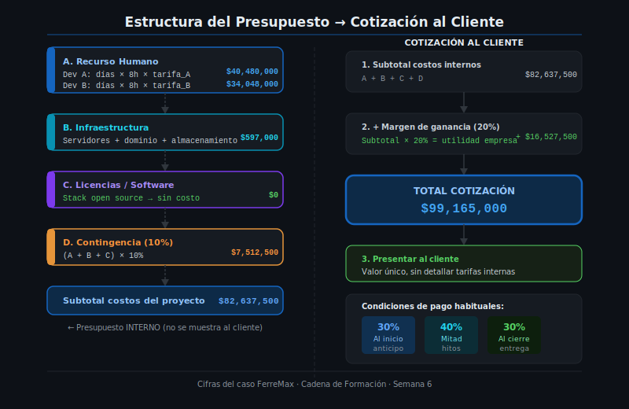

# Estructura del Presupuesto de un Proyecto de Software

## 🎯 Objetivos

- Conocer las secciones que componen un presupuesto profesional
- Entender la diferencia entre presupuesto (costo) y cotización (precio al cliente)
- Aprender a presentar el presupuesto en la propuesta técnica

---

## 1. Presupuesto vs. Cotización: dos documentos diferentes

Este es uno de los conceptos más confundidos en proyectos de software:

| Concepto | ¿Para quién es? | ¿Qué incluye? | ¿Se comparte con el cliente? |
|----------|----------------|---------------|------------------------------|
| **Presupuesto interno** | La empresa / el desarrollador | Costos reales del proyecto | No (es confidencial) |
| **Cotización / Propuesta comercial** | El cliente | Costos + margen de ganancia | Sí |

**Flujo típico:**

```
1. Calcula el presupuesto interno (lo que te cuesta)
        ↓
2. Agrega el margen de ganancia (tu utilidad)
        ↓
3. Presenta la cotización al cliente (lo que le cobras)
```

El cliente solo ve el número final. La estructura de costos interna es información de la empresa.

---

## 2. Estructura estándar de un presupuesto de software



### Sección A — Recurso Humano

Es la tabla central del presupuesto. Incluye a **cada persona del equipo**, cuántos días trabaja y a qué tarifa:

| Rol | Perfil | Días-persona | Horas/día | Tarifa/hora (COP) | Subtotal (COP) |
|-----|--------|-------------|-----------|------------------|----------------|
| Dev A | Semi-senior | 97 | 8 | $55,000 | $42,680,000 |
| Dev B | Junior | 97 | 8 | $38,000 | $29,488,000 |
| **Subtotal RH** | | | | | **$72,168,000** |

> En proyectos simples puede haber solo una fila. En proyectos con analista, tester y PM puede haber 5 o más.

---

### Sección B — Infraestructura y Servicios

Todos los costos técnicos que no son personas:

| Ítem | Especificación | Cantidad | Costo unitario (COP) | Subtotal (COP) |
|------|---------------|----------|---------------------|----------------|
| Servidor VPS (staging + producción) | AWS EC2 t3.small | 4 meses | $150,000/mes | $600,000 |
| Dominio web | .com.co — 1 año | 1 | $45,000 | $45,000 |
| Certificado SSL | Let's Encrypt (gratuito) | — | $0 | $0 |
| **Subtotal Infraestructura** | | | | **$645,000** |

---

### Sección C — Licencias y Software

Herramientas de pago requeridas:

| Herramienta | Licencia | Duración | Costo (COP) |
|-------------|---------|----------|-------------|
| Stack open source (Python, PostgreSQL, React) | Gratuito | — | $0 |
| **Subtotal Licencias** | | | **$0** |

Si el proyecto usa herramientas de pago, esta sección crece. Si el stack es open source, puede quedar en cero.

---

### Sección D — Contingencia

Se calcula como porcentaje sobre el subtotal de costos directos (A + B + C):

```
Subtotal A + B + C = $72,168,000 + $645,000 + $0 = $72,813,000
Contingencia (10%)  = $72,813,000 × 0.10 = $7,281,300
```

| Concepto | Base de cálculo | % | Valor (COP) |
|----------|----------------|---|-------------|
| Contingencia | Subtotal costos directos | 10% | $7,281,300 |

---

### Sección E — Subtotal de costos (antes del margen)

```
Categoría                  Valor (COP)
─────────────────────────────────────
A. Recurso Humano          $72,168,000
B. Infraestructura             $645,000
C. Licencias                        $0
D. Contingencia             $7,281,300
─────────────────────────────────────
SUBTOTAL COSTOS            $80,094,300
```

---

### Sección F — Margen de Ganancia (solo en la cotización)

El margen es la utilidad de la empresa o consultora. Se calcula sobre el subtotal de costos:

```
Margen de ganancia (20%) = $80,094,300 × 0.20 = $16,018,860
TOTAL COTIZACIÓN = $80,094,300 + $16,018,860 = $96,113,160
```

**¿Cuánto margen cobrar en Colombia?**

| Tipo de proveedor | Margen típico |
|-------------------|---------------|
| Freelance individual | 0–15% (ya está en la tarifa) |
| Consultora pequeña | 15–25% |
| Empresa de software mediana | 20–35% |
| Firma grande o integrador | 30–50% |

> 💡 Para proyectos de formación o propuestas de aprendices SENA, el margen puede ser 0 si la propuesta es solo un ejercicio académico, o muy pequeño si se simula una empresa.

---

## 3. Presentación del presupuesto en la propuesta técnica

La sección de costos en la propuesta técnica que le presentas al cliente debe ser **clara, sin detalle interno** que no corresponda compartir:

**Formato recomendado (resumen para el cliente):**

| Concepto | Descripción | Valor (COP) |
|----------|-------------|-------------|
| Desarrollo del sistema | Equipo de 2 desarrolladores, 15 semanas | $72,168,000 |
| Infraestructura y servicios | Servidor, dominio, SSL | $645,000 |
| Gestión y contingencia | Reserva para imprevistos (10%) | $7,281,300 |
| **Subtotal antes del margen** | | **$80,094,300** |
| Margen de servicios profesionales (20%) | | $16,018,860 |
| **TOTAL COTIZACIÓN** | | **$96,113,160** |

> El cliente ve el total desglosado, pero no necesita saber cuánto cobra exactamente cada developer.

---

## 4. Supuestos del presupuesto

Todo presupuesto incluye una lista de supuestos: condiciones que se asumen como verdaderas al hacer los cálculos. Si un supuesto no se cumple, el precio puede cambiar.

Ejemplos de supuestos para un presupuesto de software:

- **SP-01**: Las tarifas de los desarrolladores son fijas durante todo el proyecto; no aplican aumentos por inflación.
- **SP-02**: Las tarifas de infraestructura en la nube son estables; variaciones del dólar no se trasladan al cliente.
- **SP-03**: No se realizarán cambios de alcance después de aprobada la propuesta; cambios adicionales generan una cotización adicional.
- **SP-04**: El proyecto se desarrolla sin interrupciones mayores; demoras por causas del cliente (aprobaciones, datos) pueden afectar el costo final.
- **SP-05**: El presupuesto no incluye capacitación adicional fuera de las 2 sesiones definidas en el alcance.

---

## 5. Ciclo completo: de la estimación al precio

Ahora que tienes todo el contexto, el flujo completo es:

```
Semana 4: Estimación de esfuerzo
    → 194 días-persona por módulo
          ↓
Semana 5: Cronograma
    → 15 semanas, 2 devs
          ↓
Semana 6: Presupuesto
    → Días-persona × tarifa → costo RH
    → + Infraestructura
    → + Contingencia
    → + Margen de ganancia
    → = Total cotización al cliente
```

Este es el flujo que conecta las semanas 4, 5 y 6 de este bootcamp.

---

## ✅ Checklist de verificación

Después de esta clase, deberías poder:

- [ ] Explicar la diferencia entre presupuesto interno y cotización al cliente
- [ ] Armar una tabla de presupuesto con las 4 secciones (RH, infraestructura, licencias, contingencia)
- [ ] Calcular la contingencia correctamente (sobre el subtotal)
- [ ] Agregar el margen de ganancia sobre el subtotal total
- [ ] Redactar los supuestos del presupuesto
