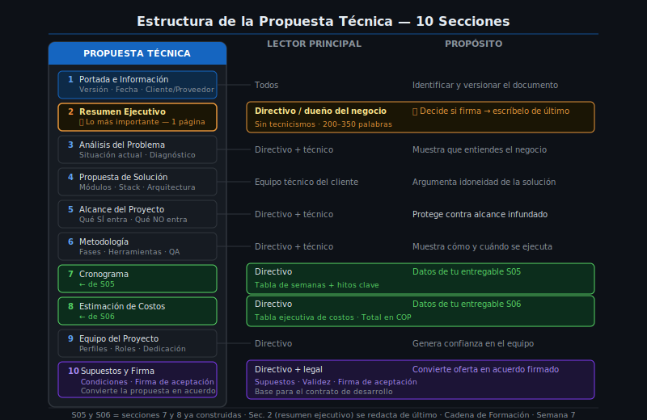

# 📑 Las 10 Secciones de una Propuesta Técnica Profesional

> **Referencia**: Cadena de Formación · Semana 7 · Teoría 01



---

## 🎯 Objetivos de esta lectura

- Conocer las secciones que componen una propuesta técnica estándar
- Entender el propósito de cada sección y a quién va dirigida
- Identificar qué entregables de semanas anteriores alimentan cada sección

---

## 1. ¿Qué es una propuesta técnica?

Una **propuesta técnica** es un documento formal que describe:

1. El **problema** o necesidad del cliente
2. La **solución** que el equipo de desarrollo propone
3. El **alcance** exacto del trabajo
4. Cómo y cuándo se va a **ejecutar** (metodología + cronograma)
5. **Cuánto va a costar** (resumen del presupuesto)
6. Las **condiciones** bajo las que se acepta el trabajo

Es el documento central que un aprendiz o consultor TI le entrega a un posible cliente **antes de firmar un contrato**. Si el cliente acepta la propuesta, sobre ese documento se construye el contrato.

---

## 2. Diferencia entre propuesta técnica, cotización y contrato

| Documento | ¿Qué describe? | ¿Quién lo firma? | ¿En qué semana? |
|-----------|---------------|------------------|-----------------|
| **Cotización** | Solo el precio y condiciones de pago | Nadie (es una oferta) | S06 |
| **Propuesta técnica** | Solución completa: problema, solución, alcance, metodología, cronograma, costos | Opcionalmente el proveedor | S07 (esta semana) |
| **Contrato de desarrollo** | Mismos elementos + cláusulas legales + sanciones | Ambas partes (cliente + proveedor) | S08 / post-propuesta |

> La propuesta técnica es el puente entre "te explico lo que voy a hacer" y "lo hago legalmente obligatorio".

---

## 3. Las 10 secciones estándar

| # | Sección | Propósito | Lector principal |
|---|---------|-----------|-----------------|
| 1 | **Portada e información general** | Identificar el documento: cliente, proveedor, versión, fecha | Todos |
| 2 | **Resumen ejecutivo** | 1 página con el problema, la solución y el precio para el directivo | Directivo / dueño del negocio |
| 3 | **Antecedentes y análisis del problema** | Contexto del cliente: situación actual y por qué necesita el sistema | Directivo + técnico |
| 4 | **Propuesta de solución técnica** | Qué se va a construir: sistema, módulos, tecnologías, arquitectura general | Equipo técnico del cliente |
| 5 | **Alcance del proyecto** | Qué SÍ entra y qué NO entra; WBS/EDT de los módulos | Directivo + técnico |
| 6 | **Metodología de desarrollo** | Cómo se va a trabajar: fases, entregas intermedias, herramientas | Directivo + técnico |
| 7 | **Cronograma** | Cuánto tiempo toma; hitos clave; fecha tentativa de entrega | Directivo |
| 8 | **Estimación de costos** | Tabla resumen del presupuesto y total de la cotización | Directivo |
| 9 | **Equipo del proyecto** | Quiénes trabajan en el proyecto; perfiles y responsabilidades | Directivo |
| 10 | **Supuestos, condiciones y firma** | Acuerdos base; qué cambia si los supuestos se modifican; espacio de firma | Directivo + legal |

---

## 4. Orden y lógica de las secciones

Las secciones no son arbitrarias — siguen una **lógica de convencimiento**:

```
Problema       →   Solución       →   Cómo       →   Cuánto      →   Acuerdo
(Sec. 2–3)         (Sec. 4–5)         (Sec. 6–7)     (Sec. 8–9)      (Sec. 10)
```

El cliente primero necesita reconocer que tiene un problema (**sección 3**), luego ver que la solución es adecuada (**sección 4**), entender que es viable (**secciones 5–7**), saber que puede pagarlo (**sección 8**) y finalmente comprometerse (**sección 10**).

> 💡 **Nota pedagógica**: El resumen ejecutivo (sección 2) va primero en el documento pero **se escribe de último**, cuando ya tienes todos los datos. Contiene un resumen de todo lo demás.

---

## 5. Tres tipos de lector en tu propuesta

| Tipo de lector | Cargo habitual | ¿Qué le importa? | ¿Qué secciones lee? |
|---------------|----------------|-----------------|---------------------|
| **Directivo / dueño** | Gerente, CEO, dueño de PYME | ¿Cuánto cuesta? ¿Cuándo está listo? ¿Vale la pena? | Resumen ejecutivo, cronograma, costos |
| **Técnico del cliente** | Jefe de sistemas, desarrollador interno | ¿Qué tecnologías usan? ¿Cómo funciona la arquitectura? ¿Puedo mantenerlo? | Solución técnica, alcance, metodología |
| **Operativo del cliente** | Contador, vendedor, bodeguero | ¿Cómo lo voy a usar? ¿Me cambia el trabajo? | Alcance (qué módulos), cronograma |

> **Regla de oro**: El directivo paga. Si el directivo no entiende la propuesta, no firma. Escribe el resumen ejecutivo para el gerente de FerreMax, no para tu instructor de programación.

---

## 6. Cuántas páginas debe tener

La longitud depende del tamaño del proyecto:

| Tamaño del proyecto | Páginas aproximadas |
|--------------------|---------------------|
| Proyecto pequeño (< 3 meses, $15M–$40M COP) | 8–12 páginas |
| Proyecto mediano (3–6 meses, $40M–$120M COP) | 12–20 páginas |
| Proyecto grande (> 6 meses, > $120M COP) | 20–40+ páginas |

**Para el caso FerreMax** (15 semanas, ~$99M COP): la propuesta técnica completa debe tener entre **14 y 18 páginas**, incluyendo tablas y el Gantt resumido.

---

## 7. Relación con las semanas anteriores

Cada semana del bootcamp construyó una sección de esta propuesta:

| Semana | Entregable | Sección de la propuesta técnica |
|--------|------------|--------------------------------|
| S02 | Lista de requisitos funcionales y NFR | Insumo para Sección 4 (solución) y Sección 5 (alcance) |
| S03 | Documento de alcance + WBS | Sección 5 (alcance del proyecto) |
| S04 | Estimación de esfuerzo | Insumo para Sección 8 (costos) |
| S05 | Cronograma y equipo | Sección 7 (cronograma) |
| S06 | Presupuesto y cotización | Sección 8 (estimación de costos) |
| **S07** | **Propuesta técnica completa** | **Todas las secciones integradas** |

---

## ✅ Checklist de esta lectura

- [ ] Enumero de memoria las 10 secciones de una propuesta técnica
- [ ] Explico la diferencia entre propuesta técnica, cotización y contrato
- [ ] Identifico para quién está escrita cada sección (tipo de lector)
- [ ] Relaciono cada entregable de S02 a S06 con su sección en la propuesta

---

*Cadena de Formación · Tecnólogo ADSO · Semana 7 de 9*
