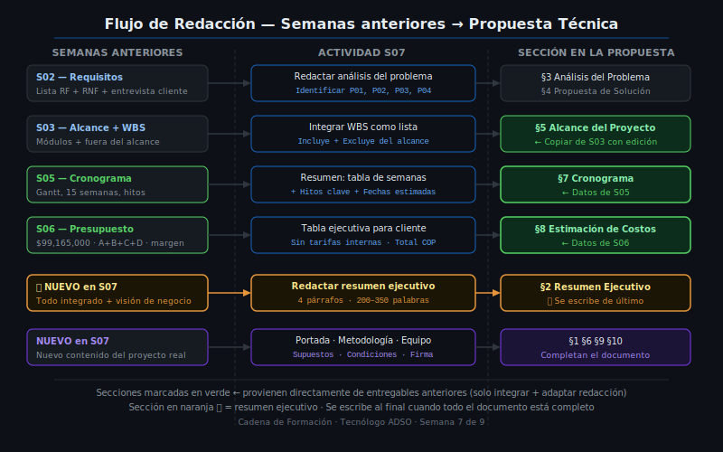

# 🗂️ Secciones Obligatorias — Qué Va en Cada Parte

> **Referencia**: Cadena de Formación · Semana 7 · Teoría 03



---

## 🎯 Objetivos de esta lectura

- Conocer en detalle el contenido de cada sección de la propuesta técnica
- Identificar los errores más comunes al redactar cada sección
- Aplicar las guías de estilo al escribir el entregable S07

---

## Sección 1 — Portada e Información General

La portada es la "tarjeta de presentación" del documento. Debe incluir:

| Campo | Descripción | Ejemplo FerreMax |
|-------|-------------|-----------------|
| Nombre del documento | Tipo de documento | "Propuesta Técnica" |
| Nombre del proyecto | Nombre del sistema que se va a construir | "Sistema de Gestión FerreMax" |
| Versión | Número de revisión del documento | `v1.0` |
| Fecha de emisión | Cuándo se emite esta versión | `15 de noviembre de 2024` |
| Válida hasta | Fecha de vencimiento de la oferta | `15 de diciembre de 2024` |
| Cliente | Empresa que recibe la propuesta | FerreMax S.A.S. — NIT: 900.XXX.XXX-X |
| Contacto cliente | Persona con quien se negocia | Carlos Ramírez — Gerente General |
| Proveedor / Consultor | Quién elabora la propuesta | [Tu nombre] — [Tu ciudad] |
| Ficha SENA | Para identificación académica | Ficha [X] |

> **Importante**: La portada también lleva el **control de cambios** si el documento tiene más de una versión: fecha, descripción del cambio y autor.

---

## Sección 2 — Resumen Ejecutivo

Ya visto en detalle en la Teoría 02. Estructura resumida:

- **Párrafo 1**: El problema del cliente (hechos concretos)
- **Párrafo 2**: La solución propuesta (qué se construye, con qué)
- **Párrafo 3**: Cómo y cuánto tiempo (metodología simplificada + duración)
- **Párrafo 4**: Precio total + condiciones de pago más importantes

**Se escribe de último**. Extensión: 200–350 palabras.

---

## Sección 3 — Antecedentes y Análisis del Problema

Esta sección responde: *¿Por qué el cliente necesita este sistema?*

### Subsecciones recomendadas

**3.1 Descripción de la organización cliente**

En 2–3 párrafos: quién es el cliente, a qué se dedica, cuántos empleados tiene, en qué ciudad opera.

> Ejemplo FerreMax: "FerreMax S.A.S. es una empresa familiar con 12 años de operación en el sector ferretero de Cali, con tres puntos de venta ubicados en los barrios X, Y y Z. Cuenta con 15 empleados y un volumen mensual de ventas promedio de $120,000,000 COP."

**3.2 Situación actual (procesos manuales / sistemas existentes)**

Describe cómo funciona actualmente el proceso que se va a digitalizar. Puede incluir una tabla de herramientas que usa hoy:

| Proceso | Herramienta actual | Problema identificado |
|---------|-------------------|----------------------|
| Control de inventario | Libro Excel compartido por WhatsApp | Versiones desactualizadas entre sucursales |
| Registro de ventas | Facturas en papel talonario | Difícil auditoría; pérdida de documentos |
| Gestión de clientes | Agenda personal del gerente | Información no centralizada |

**3.3 Problemática identificada (diagnóstico)**

Lista de problemas concretos que justifican el proyecto:

- **P01** — Inconsistencia de stock: El mismo producto puede aparecer con stock positivo en sucursal A y en cero en sucursal B sin cruce en tiempo real.
- **P02** — Pérdida de trazabilidad de ventas: No hay un historial digital de ventas por cliente ni por vendedor.
- **P03** — Dificultad para generar reportes gerenciales: El gerente construye los reportes de ventas manualmente cada semana en Excel.
- **P04** — Riesgo de pérdida de información: Los archivos de Excel están en el computador local de cada punto de venta sin copia de seguridad automática.

---

## Sección 4 — Propuesta de Solución Técnica

Esta sección responde: *¿Qué vamos a construir para resolver el problema?*

### Subsecciones recomendadas

**4.1 Descripción general de la solución**

Describe en 1–2 párrafos el sistema en términos de negocio (no técnicos):

> "Se propone el desarrollo de un sistema web de acceso multi-sucursal que centraliza el inventario, las ventas y la gestión de clientes de FerreMax en una única plataforma. Los empleados accederán al sistema desde cualquier dispositivo con conexión a internet mediante credenciales personales, con roles diferenciados por sucursal y cargo."

**4.2 Módulos del sistema**

Lista de los módulos que se van a desarrollar (viene del WBS de S03):

| Módulo | Descripción funcional | Usuarios que lo usan |
|--------|----------------------|---------------------|
| M1 — Autenticación | Registro, inicio de sesión, roles y permisos | Todos |
| M2 — Inventario | Gestión de productos, stock por sucursal, alertas de mínimo | Jefe de bodega, vendedor |
| M3 — Clientes y proveedores | CRUD de clientes y proveedores, historial de compras | Administrador, vendedor |
| M4 — Ventas y facturación | Registro de ventas, generación de factura, reserva de stock | Vendedor, cajero |
| M5 — Reportes y dashboard | Tableros de ventas, stock, rotación de productos por sucursal | Gerente |
| M6 — Configuración | Sucursales, usuarios, rangos de alerta de inventario | Administrador |

**4.3 Stack tecnológico propuesto**

| Capa | Tecnología | Justificación |
|------|-----------|---------------|
| Backend | Python + FastAPI | Alto rendimiento, curva de aprendizaje baja, open source |
| Base de datos | PostgreSQL | Robusto, gratuito, soporta multiusuario concurrente |
| Frontend | React + Vite | Interfaz reactiva, compatible con todos los navegadores |
| Infraestructura | AWS (EC2 + S3) | Disponibilidad 99.9%, escalable, soporte en Latinoamérica |
| Control de versiones | Git + GitHub | Estándar de la industria, trazabilidad de cambios |

**4.4 Arquitectura general**

Descripción en 3–5 oraciones de cómo se conectan los componentes (sin diagrama complejo):

> "La solución sigue una arquitectura cliente-servidor de tres capas: el frontend en React consume una API REST construida con FastAPI, que a su vez se comunica con la base de datos PostgreSQL alojada en AWS RDS. Todos los recursos están desplegados en la región us-east-1 de AWS, con acceso HTTPS y autenticación mediante JWT. Las copias de seguridad de la base de datos se ejecutan automáticamente cada 24 horas."

---

## Sección 5 — Alcance del Proyecto

Esta sección viene **directamente del documento de alcance de la Semana 3**.

### 5.1 En el alcance (WBS)

Lista de módulos y funcionalidades que sí están incluidas en el precio. Puede usar el WBS en formato lista o tabla.

### 5.2 Fuera del alcance

Lista explícita de lo que **no** está incluido. Esta lista protege al proveedor de solicitudes futuras no pagadas.

Ejemplo para FerreMax:
- Integración con facturación electrónica DIAN (se puede cotizar aparte)
- App móvil nativa para Android o iOS
- Migración de datos históricos de archivos Excel (excede 3 años de datos)
- Diseño de marca institucional (logos, paleta de colores)
- Capacitación formal a empleados (1 sesión de inducción incluida; capacitaciones adicionales: aparte)

---

## Sección 6 — Metodología de Desarrollo

| Elemento | Descripción para FerreMax |
|----------|--------------------------|
| Enfoque | Iterativo e incremental (mini-sprints de 2 semanas) |
| Fases | Inicio → Análisis → Desarrollo por módulo → Pruebas → Despliegue |
| Reuniones | Check-in semanal de 30 minutos con el gerente (virtual o presencial) |
| Entregables por fase | Demo funcional al finalizar cada módulo para validación del cliente |
| Herramientas de gestión | GitHub Projects (tablero de tareas) + Google Meet (videoconferencias) |
| Control de calidad | Pruebas unitarias + prueba de aceptación con el cliente antes de cada entrega |
| Forma de entrega | Acceso al sistema en ambiente de staging + código fuente en repositorio privado |

---

## Sección 7 — Cronograma

Esta sección incluye **el cronograma de la Semana 5** en formato resumido.

Puede ser:
- Una tabla de 15 filas (una por semana) con las actividades principales
- Un Gantt simplificado como imagen
- O ambos

> En la propuesta escrita en Markdown, se recomienda la tabla. El Gantt puede incluirse como imagen adjunta.

---

## Sección 8 — Estimación de Costos

Esta sección incluye **la tabla ejecutiva del presupuesto de la Semana 6** (no el presupuesto interno con detalle de tarifas).

| Concepto | Valor (COP) |
|----------|-------------|
| Desarrollo del sistema (6 módulos) | $75,000,000 |
| Infraestructura y configuración | $597,000 |
| Gestión y control del proyecto | $7,000,000 |
| Reserva técnica y ajustes | $7,568,000 |
| **TOTAL** | **$90,165,000** |
| IVA (si aplica, según régimen tributario) | A convenir |
| **TOTAL propuesta** | **$99,165,000** |

---

## Sección 9 — Equipo del Proyecto

| Perfil | Rol en el proyecto | Experiencia | Dedicación |
|--------|--------------------|-------------|------------|
| Dev A — [Nombre] | Desarrollador semi-senior full-stack, líder técnico | 3+ años en Python/React | 80% |
| Dev B — [Nombre] | Desarrollador junior full-stack, soporte | 1.5 años en Python/React | 80% |

> Para una propuesta real, aquí van los CVs resumidos (1 párrafo por perfil con tecnologías y proyectos relevantes).

---

## Sección 10 — Supuestos, Condiciones y Firma

### Supuestos

Mismos supuestos del presupuesto de S06 + supuestos técnicos y de negocio:

| ID | Supuesto |
|----|----------|
| SP-01 | El cliente proporciona acceso a la red interna y al dominio web en los primeros 5 días hábiles. |
| SP-02 | El precio del servidor AWS puede variar ±10% sin afectar el presupuesto (cubierto por contingencia). |
| SP-03 | El cliente responde revisiones en máximo 5 días hábiles. Demoras adicionales pueden extender el cronograma. |
| SP-04 | El stack tecnológico propuesto es aprobado antes del inicio de desarrollo. |
| SP-05 | No se requiere integración con sistemas de terceros externos (ERP, pasarelas de pago). |

### Condiciones comerciales

- Validez de la propuesta: 30 días calendario desde la fecha de emisión
- Forma de pago: 30% anticipo · 40% hitos intermedios · 30% entrega final
- Cambios de alcance: deben acordarse por escrito con adenda al contrato; pueden implicar ajuste de precio

### Firma de aceptación

```
ACEPTACIÓN DE LA PROPUESTA

Cliente: ____________________________   Cargo: ______________________
Fecha: ______________________________   Firma: ______________________

Proveedor: __________________________   Cargo: ______________________
Fecha: ______________________________   Firma: ______________________
```

> La propuesta técnica con estos campos firmados tiene valor como acuerdo de intención. Se recomienda formalizar con un contrato de desarrollo antes de iniciar el trabajo.

---

## ✅ Checklist de esta lectura

- [ ] Sé qué va en la portada (6 campos mínimos)
- [ ] Puedo redactar las subsecciones 3.1, 3.2 y 3.3 del análisis del problema
- [ ] Identifico la diferencia entre "en el alcance" y "fuera del alcance"
- [ ] Entiendo para qué sirven los supuestos en la sección 10

---

*Cadena de Formación · Tecnólogo ADSO · Semana 7 de 9*
