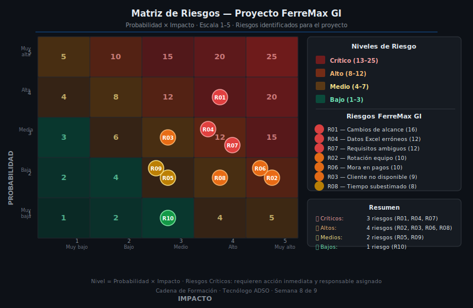

# 03 — Gestión de Riesgos del Proyecto

## 🎯 Objetivos

- Comprender qué es un riesgo en el contexto de un proyecto de software
- Identificar las categorías de riesgo más comunes en proyectos TI colombianos
- Construir una matriz de riesgos con probabilidad, impacto y estrategia de respuesta
- Distinguir las 4 estrategias de respuesta: mitigar, evitar, transferir y aceptar

---

## 1. ¿Qué es un Riesgo de Proyecto?

Un **riesgo** es un evento **incierto** que, si ocurre, afecta el alcance, el tiempo, el costo o la calidad del proyecto.

Los riesgos no son problemas que ya ocurrieron — eso se llama **incidente** o **issue**. Los riesgos son posibilidades futuras que el equipo identifica y para las cuales se prepara.

| Concepto | Definición | Ejemplo |
|---|---|---|
| **Riesgo** | Evento incierto que puede ocurrir o no | "El cliente puede no aprobar los módulos en el tiempo esperado" |
| **Incidente / Issue** | Problema que ya ocurrió | "El cliente no respondió la solicitud de aprobación esta semana" |
| **Restricción** | Limitación conocida desde el inicio | "El presupuesto máximo es $100,000,000 COP" |

---

## 2. Categorías de Riesgo en Proyectos de Software

Los riesgos de un proyecto de software se agrupan en categorías. Identificar la categoría ayuda a no olvidar tipos de riesgos importantes:

| Categoría | Descripción | Ejemplos típicos |
|---|---|---|
| **Técnico** | Problemas relacionados con la tecnología, la arquitectura o los requisitos | Requisitos mal definidos, incompatibilidades técnicas, rendimiento insuficiente |
| **Gestión** | Problemas de planificación, estimación o coordinación del proyecto | Tiempo subestimado, hitos no alcanzados, falta de seguimiento |
| **Comunicación** | Problemas de disponibilidad o entendimiento entre el equipo y el cliente | Cliente no disponible, cambios verbales sin documentar, malentendidos |
| **Financiero** | Problemas con los pagos o con el flujo de caja del proyecto | Retraso en el anticipo, incumplimiento en cuotas, variación de precios |
| **Recursos humanos** | Problemas con la disponibilidad o capacidad del equipo | Rotación de personal, enfermedad, sobrecarga de trabajo |
| **Externo / Legal** | Factores fuera del control del equipo | Cambios en normativa (DIAN, MinTIC), fallas en servicios de terceros |

---

## 3. La Matriz de Riesgos Probabilidad/Impacto

La **matriz de riesgos** es la herramienta principal para analizar y priorizar riesgos. Funciona así:

### Escala de Probabilidad (1–5)

| Valor | Nivel | Significado |
|---|---|---|
| 1 | Muy baja | Podría ocurrir en casos excepcionales (~10% de probabilidad) |
| 2 | Baja | Puede ocurrir ocasionalmente (~25%) |
| 3 | Media | Puede ocurrir en algún momento (~50%) |
| 4 | Alta | Es probable que ocurra (~75%) |
| 5 | Muy alta | Es casi seguro que ocurrirá (~90%) |

### Escala de Impacto (1–5)

| Valor | Nivel | Significado |
|---|---|---|
| 1 | Muy bajo | Efecto despreciable en el proyecto |
| 2 | Bajo | Leve retraso o incremento de costos (<5%) |
| 3 | Medio | Retraso moderado o incremento significativo (5–15%) |
| 4 | Alto | Retraso importante o incremento considerable (>15%) |
| 5 | Muy alto | Paralización del proyecto o costo inasumible |

### Nivel de Riesgo

```
Nivel de Riesgo = Probabilidad × Impacto
```

| Puntaje | Nivel | Color | Acción requerida |
|---|---|---|---|
| 1–3 | Bajo | 🟢 Verde | Aceptar — monitoreo pasivo |
| 4–7 | Medio | 🟡 Amarillo | Mitigar — plan de contingencia |
| 8–12 | Alto | 🟠 Naranja | Mitigar activamente — responsable asignado |
| 13–25 | Crítico | 🔴 Rojo | Acción inmediata — puede paralizar el proyecto |

### Visualización de la Matriz

```
         IMPACTO
         1    2    3    4    5
    5  [ 5  | 10 | 15 | 20 | 25 ]  ← Muy alta
    4  [ 4  |  8 | 12 | 16 | 20 ]
P   3  [ 3  |  6 |  9 | 12 | 15 ]
R   2  [ 2  |  4 |  6 |  8 | 10 ]
O   1  [ 1  |  2 |  3 |  4 |  5 ]  ← Muy baja
B
```

> El diagrama SVG de la semana (`0-assets/01-matriz-riesgos.svg`) muestra esta matriz con los riesgos del proyecto FerreMax GI ubicados en su posición correspondiente.



---

## 4. Las 4 Estrategias de Respuesta a Riesgos

Una vez identificado y calificado el riesgo, el equipo define qué acción tomará:

### Mitigar
Reducir la probabilidad de que el riesgo ocurra, o reducir su impacto si ocurre.

> **Ejemplo:** "El cliente puede no estar disponible para las validaciones."
> **Mitigación:** Se acuerda en el contrato que el cliente designa un representante técnico con disponibilidad de 2 horas por semana. Las aprobaciones tienen un plazo máximo de 3 días hábiles.

### Evitar
Cambiar el plan del proyecto para eliminar el riesgo por completo.

> **Ejemplo:** "Usar una librería de terceros poco mantenida que puede quedarse sin soporte."
> **Evitar:** Reemplazar esa librería por una alternativa oficial bien mantenida desde el inicio.

### Transferir
Mover la responsabilidad del riesgo a un tercero (generalmente mediante seguros o contratos con proveedores).

> **Ejemplo:** "El servidor cloud puede fallar y perder datos."
> **Transferir:** La responsabilidad de la disponibilidad del servidor se transfiere a AWS mediante su SLA (acuerdo de nivel de servicio) del 99.9%.

### Aceptar
Reconocer que el riesgo existe pero decidir no tomar acción preventiva. Solo aplica para riesgos de nivel bajo (puntaje 1–3).

> **Ejemplo:** "Puede haber un corte de luz de 1 hora en las instalaciones del cliente."
> **Aceptar:** Es un riesgo de bajo impacto. Si ocurre, se reprogramará la sesión. No requiere plan especial.

---

## 5. Formato de la Tabla de Riesgos

Cada riesgo se documenta en una tabla con los siguientes campos:

| Campo | Descripción |
|---|---|
| **ID** | Identificador único: R01, R02, R03... |
| **Descripción del riesgo** | Redacción clara de qué podría ocurrir (en forma de evento) |
| **Categoría** | Técnico / Gestión / Comunicación / Financiero / Recursos / Externo |
| **Probabilidad (1–5)** | Estimación de la posibilidad de ocurrencia |
| **Impacto (1–5)** | Estimación de las consecuencias si ocurre |
| **Nivel (P×I)** | Resultado del cálculo |
| **Clasificación** | Bajo / Medio / Alto / Crítico |
| **Estrategia** | Mitigar / Evitar / Transferir / Aceptar |
| **Acción concreta** | Descripción específica de qué se hará — ⚠️ NO escribir "monitorear" como única acción |

### ✅ Ejemplo de riesgo bien documentado

| Campo | Valor |
|---|---|
| ID | R01 |
| Descripción | El cliente solicita cambios en el alcance documentado sin seguir el proceso formal |
| Categoría | Gestión |
| Probabilidad | 4 (Alta) |
| Impacto | 4 (Alto) |
| Nivel | 16 — Crítico 🔴 |
| Estrategia | Mitigar |
| Acción concreta | Incluir cláusula de control de cambios en el contrato. Cualquier cambio de alcance genera una adecuación de oferta firmada antes de ejecutarse. El instructor hará seguimiento semanal del alcance documento vs. lo implementado. |

### ❌ Ejemplo de riesgo mal documentado

| Campo | Valor |
|---|---|
| ID | R01 |
| Descripción | Riesgo técnico |
| Probabilidad | Alta |
| Impacto | Alto |
| Estrategia | Monitorear |

> ❌ No: descripción vaga, sin nivel numérico, estrategia vacía ("monitorear" no es una acción).

---

## 6. ¿Cuántos Riesgos Documentar?

| Tamaño del proyecto | Riesgos mínimos recomendados |
|---|---|
| Proyecto pequeño (<4 semanas, 1 módulo) | 5 riesgos |
| Proyecto mediano (4–6 módulos, FerreMax) | 8–12 riesgos |
| Proyecto grande (>7 módulos, integraciones) | 15–20 riesgos |

Para los proyectos del bootcamp, el **mínimo son 8 riesgos** con al menos 3 categorías distintas.

---

## 7. ¿Por Qué Incluir la Matriz de Riesgos en la Propuesta?

El cliente directivo ve la matriz de riesgos y piensa:

> *"Este equipo sabe que las cosas pueden salir mal, y tiene un plan para cada escenario. Son profesionales."*

La matriz de riesgos **genera confianza**, no miedo. No se trata de listar catástrofes, sino de demostrar que el equipo tiene experiencia gestionando proyectos reales.

---

## ✅ Checklist de Verificación

- [ ] Identifiqué riesgos en al menos 3 categorías distintas (no solo técnicos)
- [ ] Cada riesgo tiene probabilidad e impacto en escala 1–5 con justificación
- [ ] Calculé el nivel de riesgo (P×I) y classifier correctamente (bajo/medio/alto/crítico)
- [ ] La estrategia de respuesta no es solo "monitorear" — incluye acción concreta
- [ ] Los riesgos críticos (nivel >12) tienen plan de contingencia detallado
- [ ] Documenté mínimo 8 riesgos

---

*Cadena de Formación · Tecnólogo ADSO · Semana 8 de 9*
